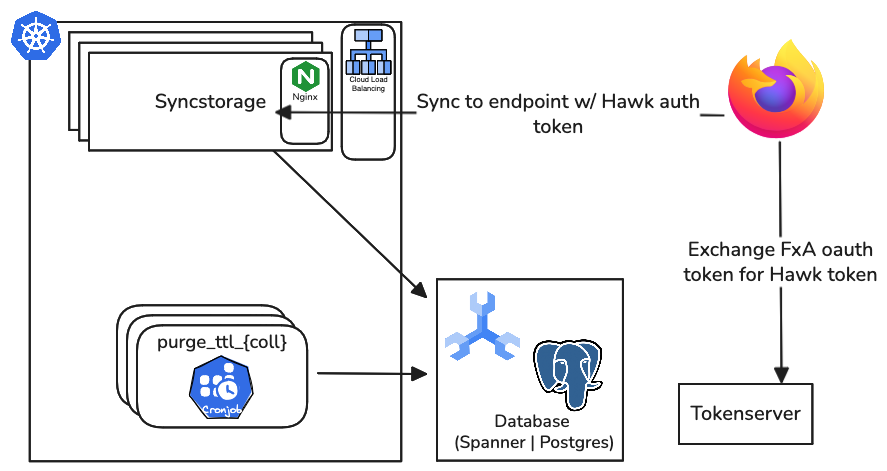
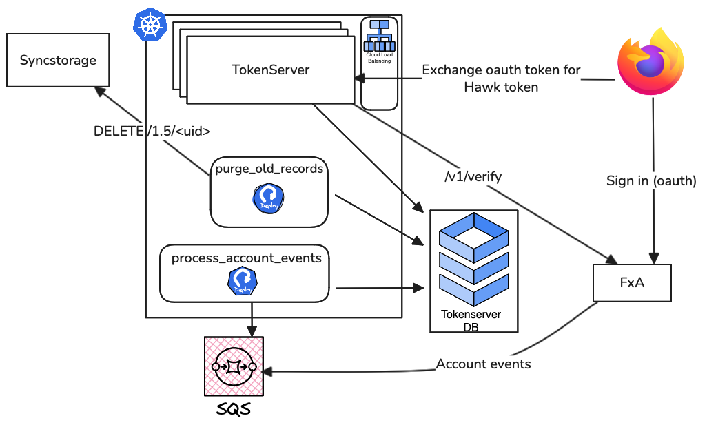
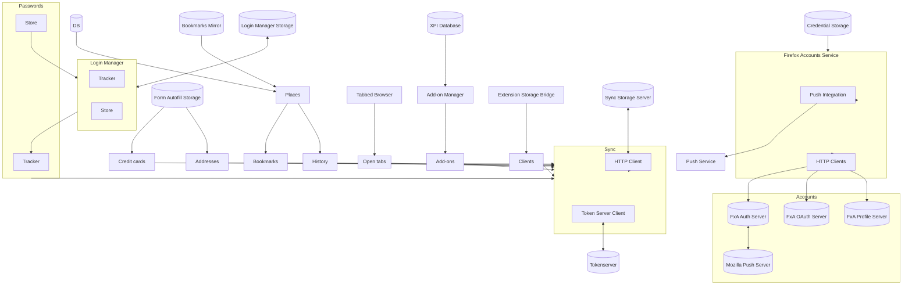

# Architecture

A high-level architectural overview of the Sync Service which includes Sync and Tokenserver.

# Syncstorage

# Tokenserver

The intent of this file is inspired by a very sensible [blog post](https://matklad.github.io/2021/02/06/ARCHITECTURE.md.html) many developers are familiar with regarding the necessity to illustrate systems with clarity. Given Sync's complexity and interrelationships with other architectures, this 

# Storage-Client Relationship
