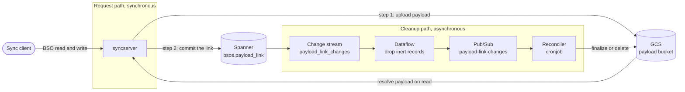
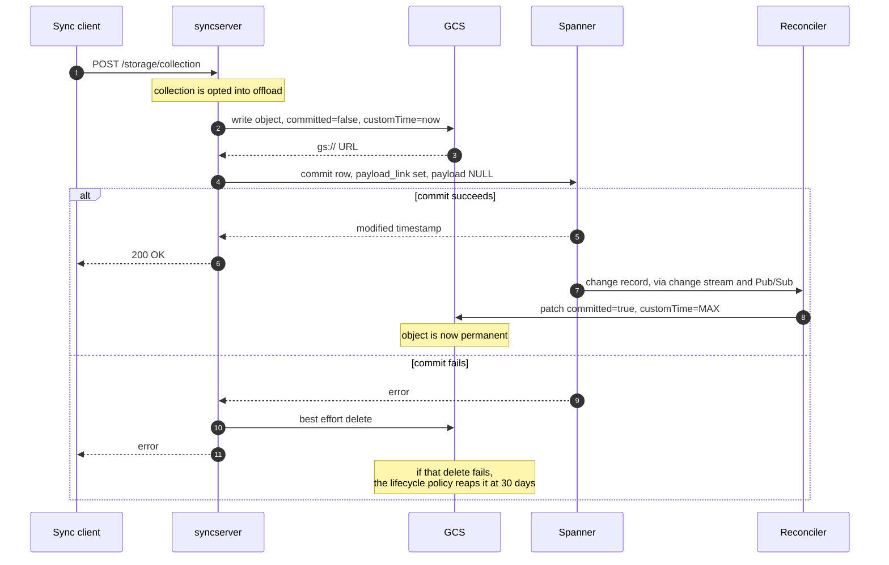
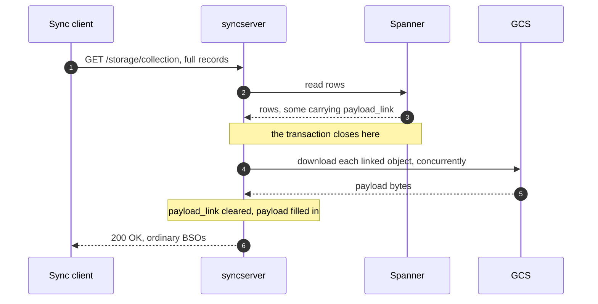
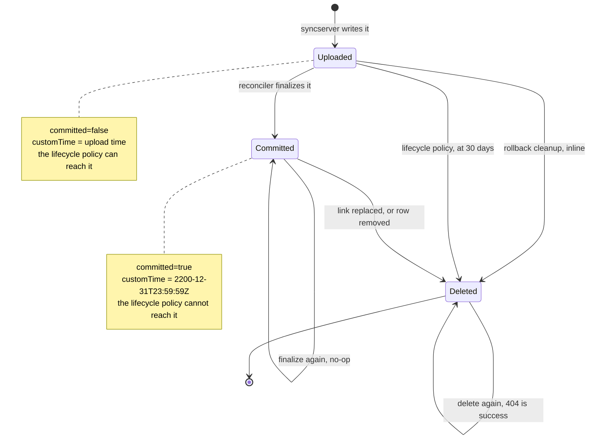

# Payload Offload

## Summary

A Sync BSO payload normally lives inline in a Spanner column, and a payload
larger than the per-record limit (2.5 MB by default) is rejected. Payload
offload lifts that ceiling for chosen collections: syncserver writes the
payload to a Google Cloud Storage object and stores only a `gs://` URL in the
BSO's `payload_link` column, leaving `payload` NULL.

Offload is off by default, opt-in per collection, and supported on the Spanner
backend only. Nothing changes for a collection that is not opted in.

Moving the payload out of the database splits one write into two, and two
writes can disagree. Everything else in this system exists to make them agree
again. A Spanner change stream reports every change to `payload_link`, and a
reconciler acts on those reports: an object a live BSO row points at is kept
forever, and everything else is deleted.

Tracking epic: STOR-372, "Expand spanner storage beyond 2.5MB".

## The two halves

The system splits cleanly into a synchronous half that a user request waits
on, and an asynchronous half that runs behind it.

**Synchronous, in the request path.** On a write, syncserver uploads the
payload to GCS *before* it opens the database transaction, then commits a row
carrying the resulting URL. On a read, it fetches the row first, then
downloads the payload from GCS *after* the database read transaction is
completed, and swaps it back into the `payload` field so the client sees an
ordinary BSO. Clients never learn that offload exists.

**Asynchronous, behind the request.** A change stream on the `payload_link`
column feeds a Dataflow job, which publishes the interesting records to
Pub/Sub, which a reconciler cronjob drains. The reconciler does two things:
it marks freshly committed objects as permanent, and it deletes objects no
row points at any more.

The asynchronous half is not on the critical path. If it stalls, reads and
writes keep working and cleanup falls behind.

## Life of a write

A few things worth knowing about that upload step. Uploads for a multi-BSO
POST run concurrently, bounded by `gcs_payload_max_concurrency`, and they
fail fast: the first upload error abandons the request, and any object already
uploaded is left for the lifecycle policy rather than deleted inline. The
compensating delete only runs when the database transaction fails, and its
result is ignored, because the lifecycle policy is a sufficient second line.

Between the upload and the finalize the object exists but is not protected.
That window is normally seconds to a few minutes, set by the reconciler's
cronjob cadence, and it is always far shorter than the 30 day lifecycle
window.

## Life of a read

The order matters. Downloads happen after the transaction closes, so a slow
GCS read never holds a Spanner transaction open. A request that only asks for
BSO ids never touches GCS at all, and neither does a collection with no
offloaded records, since there are no links to resolve.

## Life of an object

Every GCS object is in one of three states, and the whole design is a matter
of which transitions are allowed.

The important asymmetry: an object in `Uploaded` has two independent ways to
die, and an object in `Committed` has exactly one, which only a change stream
record can trigger. Age alone never deletes a committed object, because
pinning `customTime` to its maximum makes `daysSinceCustomTime` permanently
negative.

The two self-loops are not decoration. Pub/Sub delivers at least once, so
both operations are written to be safe to repeat, and a `404 NotFound` is
treated as success rather than as an error.

## Why it holds together

The design rests on a handful of invariants. Most of the subtlety in the code
is in preserving one of them.

1. **The GCS write happens before the Spanner commit.** So a committed row
   never points at an object that does not exist. The reverse, an object with
   no row, is possible, and is what the cleanup arm is for.

2. **An object is born untrusted.** Upload sets custom metadata
   `committed=false` and `customTime` to the moment of upload. At that point
   nothing has promised to keep it.

3. **Finalizing is what makes an object permanent.** The reconciler flips
   `committed=true` and pins `customTime` to `2200-12-31T23:59:59Z`. That
   pushes `daysSinceCustomTime` permanently negative, so the bucket's
   lifecycle policy can never reach the object again, no matter how old it
   gets.

4. **Only the change stream authorizes a delete.** Nothing removes a
   finalized object except a change record saying a row stopped pointing at
   it. There is no scanner, no sweeper, and no age-based deletion of
   finalized objects.

5. **A batch commit is a handoff, not a delete.** Batched writes land in
   `batch_bsos` first, and committing the batch moves the link into the
   permanent `bsos` row and drops the staging row in one transaction. The
   change stream reports that as a row that stopped pointing at the object,
   which under invariant 4 alone would delete a live payload. Syncstorage
   tags that transaction `batch_commit` and the reconciler skips the delete
   when it sees the tag. Every other `batch_bsos` removal, TTL expiry and
   `user_collections` cascade deletes among them, carries no tag and is
   treated as a real delete.

6. **Every reconciler operation is idempotent, and 404 counts as success.**
   Pub/Sub is at-least-once, so the same record is sometimes handled twice.
   Finalizing an already finalized object and deleting an already deleted one
   are both no-ops.

7. **The subscription is the retry queue.** The reconciler acks only what it
   handled. An unacked message comes back, and after five failed attempts it
   lands in a dead-letter topic rather than blocking the queue. There is no
   in-process retry loop and no in-window Kubernetes retry.

8. **The bucket lifecycle policy is the backstop.** Anything uploaded and
   never finalized, because the request died, the transaction rolled back, or
   the inline cleanup failed, is deleted 30 days after upload. That is the
   only thing standing between a crashed write and an object that leaks
   forever.

## Where to look

| Concern | Where |
| --- | --- |
| Upload, download, delete, URL parsing | `syncserver/src/web/payload_offload.rs` |
| Which collections offload, request wiring | `syncserver/src/web/handlers.rs` |
| Settings and startup validation | `syncstorage-settings/src/lib.rs` |
| `payload_link` column, change stream, access role | `syncstorage-spanner/src/schema.ddl` |
| Dataflow pipeline (prod publisher, Java) | `tools/payload-link-dataflow/` |
| Dev publisher (Python, emulator only) | `tools/payload-link-dataflow/payload-link-publisher-py/` |
| Reconciler | `tools/payload-reconciler/` |
| Local end-to-end stack | `docker/docker-compose.e2e.reconciliation.yaml` |
| Buckets, Pub/Sub, Dataflow job, IAM | `sync/tf/dev/` in webservices-infra |
| Reconciler cronjob | `sync/k8s/sync/` in webservices-infra |
| Spanner instance and database | `projects/sync` in cloudops-infra |
| Tenant projects and enabled APIs | `projects/tf/webservices` in global-platform-admin |

Behaviour of the asynchronous half is documented in
[Reconciliation Pipeline](../tools/payload_link_reconciler.md). Which GCP
project each piece lives in, and which repo defines it, is documented in
[GCP Infrastructure](../tools/payload-offload-infrastructure.md).

## Known gaps

This is a work in progress. As of this writing:

- Only the dev environment is built out. Stage and prod need the same set of
  resources plus a dedicated Spanner metadata database.
- Change stream storage cost in prod has not been measured.
