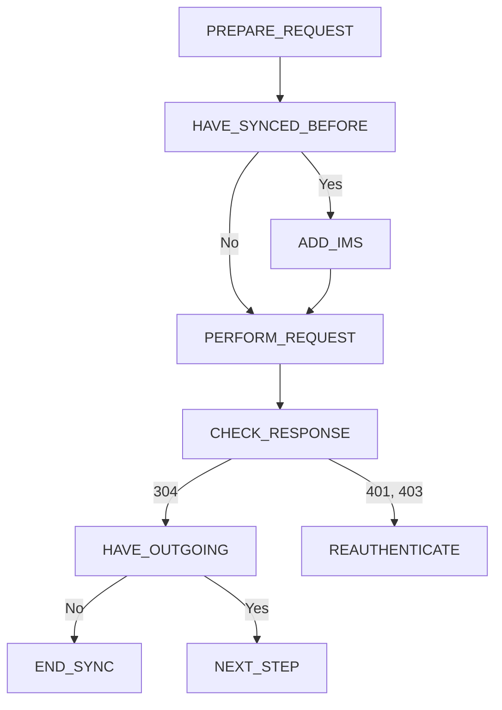
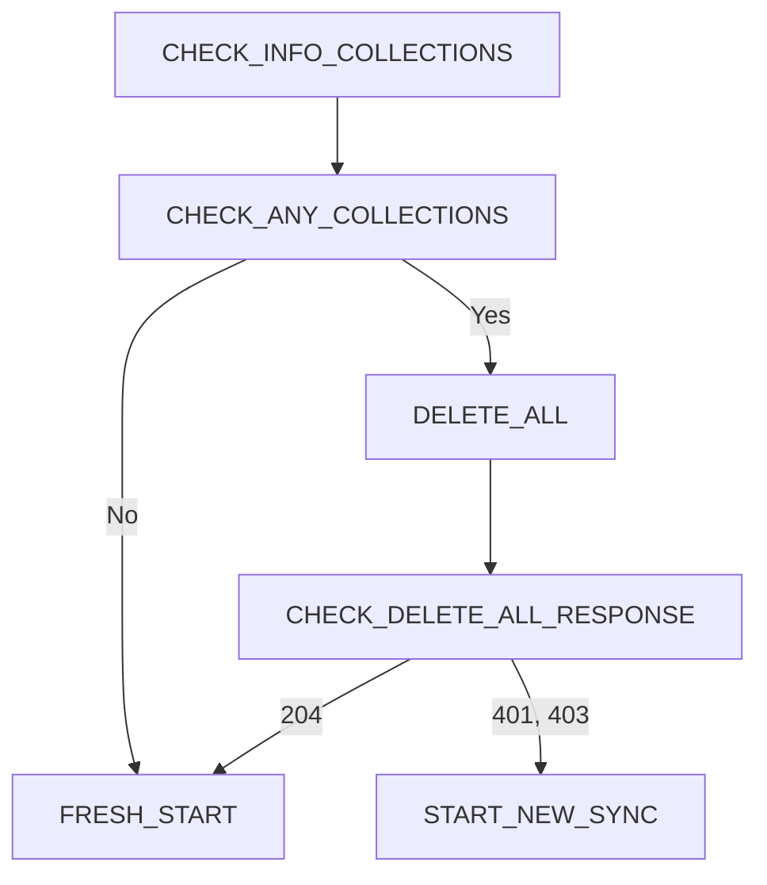
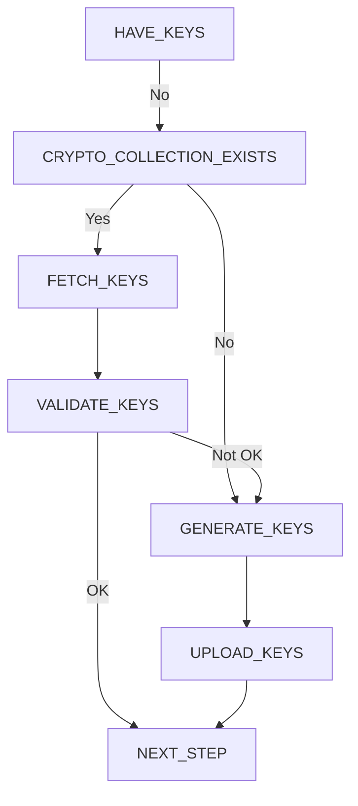

<a id="sync_lifeofasync"></a>

# The Life of a Sync

This document essentially describes how to write a Sync client.

Because the Sync server is essentially a dumb storage bucket, most of the
complexity of Sync is the responsibility of the client. This is good for users'
data security. It is bad for people implementing Sync clients. This document
will hopefully alleviate common issues and answer common questions.

Strictly speaking, information in this document applies only to a specific
version of the Sync server storage format. In practice, client behavior is
similar across storage versions. And, since we wish for clients to support
the latest/greatest versions of everything, this document will target that.

## Initial Client Configuration

The process of performing a sync starts with configuring a fresh client. Before
you can even think about performing a sync, the client needs to possess key
pieces of information. These include:

- The URL of the Sync server.
- Credentials used to access the Sync server.

Depending on the versions of the Sync server and global storage version, you
may also need a Sync Key or similar private key which is used to access
encrypted data on an existing account.

Obtaining these pieces of information is highly dependent on the server
instance you will be communicating with, the client in use, and whether you are
creating a new account or joining an existing one.

## How Mozilla and Firefox Does It

For reference, this section describes how Mozilla and Firefox handle initial
client configuration.

Inside Firefox there exists a UI to *Set up Firefox Sync*. The user chooses
whether she is setting up a new account or whether she wants to connect to an
existing account.

For completely new accounts, the user is presented with a standard sign-up
form. The user enters her email address and selects a password. Behind the
scenes Firefox is talking to a user provisioning service and the account is
created there and a Sync server is assigned (Mozilla exposes many different
Sync server instances to the Internet and the client connects directly to just
one of them). At this time, a new Sync Key encryption key is generated and
stored in Firefox's credential manager (possibly protected behind a master
password).

If the user selects an existing account, the user is presented 12 random
characters. These are entered on another device and the two devices
effectively pair and share the login credentials, Sync Key, and server info.
This is done with J-PAKE, so the data is secure as it is transported between
devices. Even the intermediary agent bridging the connection between the two
devices can't decrypt the data inside.

## Performing a Sync

### Settings and State Pre-check

To perform a sync, a client will first need to perform some basic checks:

- Do we have all necessary credentials?
  - Storage server HTTP credentials
  - Sync Key
- Are we online (do we have network connectivity)
- Are we prohibited from syncing due to result from a previous sync?
  - The server may have issued a backoff telling us to slow down, etc

If these are all satisfied, the client can move on to the next phase.

### Inspect and Reconcile Client and Server State

The initial requests performed on the Sync server serve to inspect, verify,
and reconcile high-level state between the client and server.

#### Fetch info/collections

The first request to the Sync server should be a GET on the info/collections
URI. This reveals which collections exist on the server and when they were
last modified.

If the client has synced before, it should issue a conditional HTTP request
by adding an `X-If-Modified-Since` header. If the server responds with `304`,
no modifications have been made since the last sync. If the client has no new
data to upload, it can stop immediately.

This request also verifies credentials. A `401` or `404` response should be
interpreted as credential failure, possibly requiring reauthentication.

Flow overview (graphviz source, informational only):


#### Validate meta/global

The client must validate the `meta/global` record on every sync.

Possible outcomes:

1. The `meta` collection does not exist.
2. The `meta` collection has been modified since the last sync.
3. The `meta` collection has not been modified since the last sync.

If `meta` does not exist and *any* collection exists, the client should delete
all server data to ensure a fresh state. If no collections exist, nothing needs
to be deleted.

If `meta` has not changed and a cached copy exists, no action is required.

Otherwise, fetch `meta/global`, decode the payload, and inspect the storage
version. If newer than supported, the client should stop and require upgrade.
Clients must never modify data belonging to a newer storage version.

Flow overview (graphviz source, incomplete):


#### Validate crypto/keys

The client must ensure valid cryptographic keys exist.

Flow overview (graphviz source):


### Collections Pre-Sync

Once `meta/global` and cryptographic keys are validated, the client proceeds to
sync regular collections.

The client records last-modified timestamps from `info/collections` and
requests only records changed since the last sync.

### Clients Collection

The `clients` collection is special. Clients always fetch all records from it.
It is used for inter-client commands such as data wipes, which must be processed
before syncing other collections.

## Incomplete Content

The notes below are legacy and require cleanup.

### Perform sync (pseudo-code)

```bash
// - update engine last modified timestamps from info/collections record
// - sync clients engine
//   - clients engine always fetches all records
// - process reset/wipe requests in 'firstSync' preference
// - process any commands, including the 'wipeClient' command
// - infer enabled engines from meta/global
// - sync engines
//   - only stop if 401 is encountered
// - if meta/global has changed, reupload it
```

### Syncing an engine (pseudo-code)

```bash

// - meta/global
//   - syncID
//   - engine storage format
// - fetch incoming records
     - GET .../storage/<collection>?newer=<last_sync_server_timestamp>&full=1
     - optional but recommended for streaming: Accept: application/newlines
     - deserialize and apply each record:
       - JSON parse WBO
       - JSON parse payload
       - verify HMAC
       - decrypt ciphertext witH IV
       - JSON parse cleartext
       - apply to local storage
         - TODO deduping
    - fetch outgoing records (e.g. via last sync local timestamp,
      or from list of tracked items, ...)
      - serialize each record
        - assemble cleartext record and JSON stringify
        - assemble payload and JSON stringify
          - generate random IV and encrypt cleartext to ciphertext
          - compute HMAC
        - assemble WBO and JSON stringify
        - upload in batches of 100 or 1 MB, whichever comes first
          - POST .../storage/<collection>
            [{record}, {record}, ...]
          - process repsonse body
```
