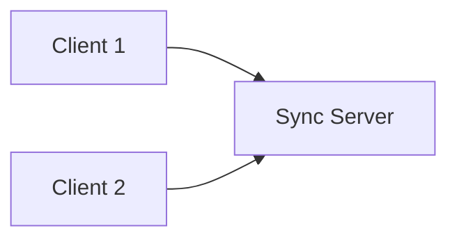

# Sync Client Overview

This section is intended to provide a comprehensive guide to how Firefox Sync clients interact with the server and ultimately with each other to provide the functionality of syncing browser data between clients.

It is a somewhat technical document, but should require no in-depth knowledge. Links to more detailed API docs offer an opportunity to dig deeper.

## Introduction

The purpose of Sync is to exchange browser data (bookmarks, history, open tabs,
passwords, add-ons, and the like) between *clients* in a manner that respects a
user's security and privacy.

Syncing is facilitated through the use of a server, where data is centrally
stored. This allows for syncing to occur without pairwise interaction between
network-connected clients.

### High-level architecture

The following diagram was originally expressed using Graphviz.  
It has been converted to Mermaid.

Sync is different from most storage-in-the-cloud services in that data is
encrypted locally—that is, it cannot be read by other parties—*before* it is
sent to the cloud. While many services encrypt data only while it is being
*transmitted*, Sync keeps your data encrypted even after it has arrived at the
server.

This means that the Sync server operators cannot read your data—even if they
wanted to. The only way your data can be read is if someone possesses your
secret **Sync Key** (sometimes referred to as a *Recovery Key*). This can occur
if your device is lost or compromised, or if you reveal it to another party.
The important fact to note is that the Sync Key is never made available to the
Sync Server, and without it, your encrypted data is statistically impossible to
recover.

That being said, the server operators do have access to some limited metadata.
This includes logs of when you connected and the types, number, and rough size
of items being synchronized. This type of information is leaked by practically
every network-connected service and should not come as a surprise.

## The Sync Server

The Sync server performs the vital role of storing data, tracking elementary
metadata, and providing authenticated access. The Sync server is effectively a
dumb shared whiteboard—a bit bucket, if you will. It plays a very small role in
the actual syncing process, and it *must* be this way: since data is encrypted
before being sent to the server, there is not much the server can do to help.

The Sync server infrastructure exposes a secure HTTP interface for:

- user management and node assignment
- storage access

The storage server is a generic service and is not Sync-specific. Sync uses it
with specific semantics for how and where data is stored. These semantics are
fully described in the Sync Storage Formats documentation.

Per-user access to the Sync server is protected via authentication at the HTTP
layer. This can be implemented however the server operator chooses. Since the
bulk of Sync’s security model resides in client-side encryption—and since the
Sync server is typically accessed over transport-level encryption such as
SSL/TLS—primitive authentication schemes such as HTTP Basic Authentication are
sufficient. In fact, Mozilla’s hosted Sync service has historically used HTTP
Basic Authentication.

## Collections and Records

The primary concept behind the Sync server’s storage model is the *collection*.
Clients store *objects*, called *records*, inside collections.

Sync clients take local data, convert it into records, and upload those records
to the Sync server. Downloading data follows the same process in reverse.

Records contain basic *public* metadata, such as the time they were last
modified. This allows clients to selectively retrieve only the records that
have changed since the last sync operation.

An important observation is that the server has no notion of a “sync” as the
client understands it. From the server’s perspective, there is simply a series
of HTTP requests arriving from various IP addresses, performing storage
operations on a backing store. The client, however, has a well-defined sequence
of actions that together form a logical sync session, which may succeed or fail
as a whole. The server does not track or enforce this notion.

## Sync Clients

A Sync Client is any entity that communicates with servers providing Sync
functionality.

Sync clients come in many different forms and may support different subsets of
features. For example, some clients may be read-only.

A given client typically targets specific versions of the storage service and
specific Sync storage formats.

## Storage Limits

Each Mozilla account is limited to **2.5 GB of data per collection**. This limit
applies across all Sync Clients associated with that account.

When a Sync Client attempts to upload more than 2.5 GB of data to a single
collection, the Sync Server will respond with a specific error code indicating a
**User over quota** condition.
