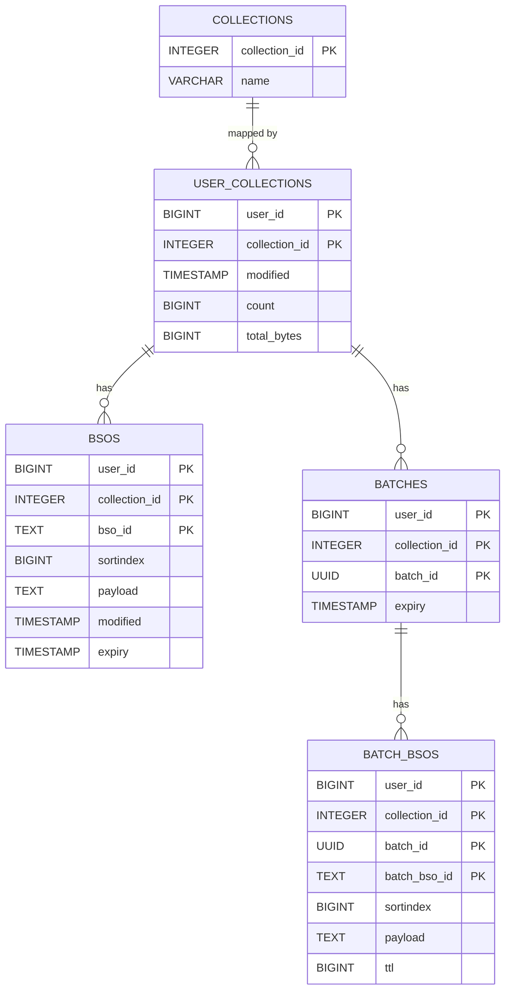

# Syncstorage Postgres Backend

## Tables Overview
| Table              | Description                                                                                      |
| ------------------ | ------------------------------------------------------------------------------------------------ |
| `user_collections` | Per-user metadata about each collection, including `last_modified`, record count, and total size |
| `bsos`             | Stores Basic Storage Objects (BSOs) that represent synced records                                |
| `collections`      | Maps collection names to their stable IDs                                                        |
| `batches`          | Temporary staging of BSOs in batch uploads                                                       |
| `batch_bsos`       | Stores BSOs that are part of a batch, pending commit                                             |

## User Collection Table
Stores per-user, per-collection metadata.

| Column          | Type        | Description                                                           |
| --------------- | ----------- | --------------------------------------------------------------------- |
| `user_id`       | `BIGINT`    | The user id (assigned by Tokenserver). PK (part 1)                    |
| `collection_id` | `INTEGER`    | Maps to a named collection. PK (part 2)                       |
| `modified`      | `TIMESTAMP` | Last modification time (server-assigned, updated on writes)           |
| `count`         | `BIGINT`    | Count of BSOs in this collection (used for quota enforcement)         |
| `total_bytes`   | `BIGINT`    | Total payload size of all BSOs (used for quota enforcement)     

Supports last-modified time tracking at the collection level.

Enables `/info/collections`, `/info/collection_counts`, and `/info/collection_usage` endpoints.

## BSOS Table
Stores actual records being synced — Basic Storage Objects.

| Column          | Type        | Description                                        |
| --------------- | ----------- | -------------------------------------------------- |
| `user_id`       | `BIGINT`    | The user id (assigned by Tokenserver), FK (part 1) to `user_collections` |
| `collection_id` | `INTEGER`    | Maps to a named collection. PK (part 2) & FK (part 2) to `user_collections`                           |
| `bso_id`        | `TEXT`      | Unique ID within a collection. PK (part 4) |
| `sortindex`     | `BIGINT`    | Indicates record importance for syncing (optional) |
| `payload`       | `TEXT`      | Bytes payload (e.g. JSON blob)                     |
| `modified`      | `TIMESTAMP` | Auto-assigned modification timestamp               |
| `expiry`        | `TIMESTAMP` | TTL as absolute expiration time (optional)         |

Indexes
`bsos_modified_idx`: for sorting by modified descending (used in sort=newest)

`bsos_expiry_idx`: for pruning expired records and TTL logic

Implements all BSO semantics from the [API spec](https://mozilla-services.readthedocs.io/en/latest/storage/apis-1.5.html#basic-storage-object)

## Collections Table
Maps internal numeric IDs to collection names.

| Column          | Type          | Description                     |
| --------------- | ------------- | ------------------------------- |
| `collection_id` | `INTEGER`      | Primary key                     |
| `name`          | `VARCHAR(32)` | Collection name, must be unique |

Used to reference collections efficiently via ID.

### Standard Collections
The following 13 standard collections are expected to exist by clients and have fixed IDs. These IDs are reserved and should not be modified.

| Collection ID | Name          | Description                                                    |
|---------------|---------------|----------------------------------------------------------------|
| 1             | `clients`     | Information about connected devices/clients                    |
| 2             | `crypto`      | Encryption-related metadata                                    |
| 3             | `forms`       | Form data and autocomplete information                         |
| 4             | `history`     | Browser history entries                                        |
| 5             | `keys`        | Encryption keys for sync                                       |
| 6             | `meta`        | Metadata about sync state                                      |
| 7             | `bookmarks`   | Browser bookmarks and folders                                  |
| 8             | `prefs`       | Browser preferences and settings                               |
| 9             | `tabs`        | Open tabs across devices                                       |
| 10            | `passwords`   | Saved login credentials                                        |
| 11            | `addons`      | Browser extensions and add-ons                                 |
| 12            | `addresses`   | Saved addresses for autofill                                   |
| 13            | `creditcards` | Saved payment methods (encrypted)                              |

### Collection ID Ranges
- **Collection IDs < 100**: Reserved for standard collections. These are the core sync collections used by most clients (see above).
- **Collection IDs >= 100**: Custom collections added by add-ons using the Sync Storage API, known integrations, or load tests (usually prefixed with "xxx").

#### Migration SQL
The standard collections are inserted during database migration:

```sql
-- These are the 13 standard collections that are expected to exist by clients.
-- The IDs are fixed.
-- Reserved spaces for additions to the standard collections begin after 100.
INSERT INTO collections (collection_id, name) VALUES
    ( 1, 'clients'),
    ( 2, 'crypto'),
    ( 3, 'forms'),
    ( 4, 'history'),
    ( 5, 'keys'),
    ( 6, 'meta'),
    ( 7, 'bookmarks'),
    ( 8, 'prefs'),
    ( 9, 'tabs'),
    (10, 'passwords'),
    (11, 'addons'),
    (12, 'addresses'),
    (13, 'creditcards');
```


## Batches Table
Temporary table for staging batch uploads before final commit.

| Column          | Type        | Description                                       |
| --------------- | ----------- | ------------------------------------------------- |
| `user_id`       | `BIGINT`    | The user id (assigned by Tokenserver), FK (part 1) to `user_collections` |
| `collection_id` | `INTEGER`   | Maps to a named collection. PK (part 2) & FK (part 2) to `user_collections` |
| `batch_id`      | `UUID`      | Client-generated or server-assigned batch ID. PK (part 3)  |
| `expiry`        | `TIMESTAMP` | Time at which batch is discarded if not committed |

Indexes:
`batch_expiry_idx`: For cleaning up stale batches

## Batch BSOS Table
Stores BSOs during a batch upload, not yet committed to bsos.

| Column          | Type     | Description                 |
| --------------- | -------- | --------------------------- |
| `user_id`       | `BIGINT` | FK to `batches`             |
| `collection_id` | `INTEGER`| FK to `batches`             |
| `batch_id`      | `UUID`   | FK to `batches`             |
| `batch_bso_id`  | `TEXT`   | Unique ID within batch      |
| `sortindex`     | `BIGINT` | Optional, for sort priority |
| `payload`       | `TEXT`   | Payload                     |
| `ttl`           | `BIGINT` | Time-to-live in seconds     |

## Database Diagram and Relationship

