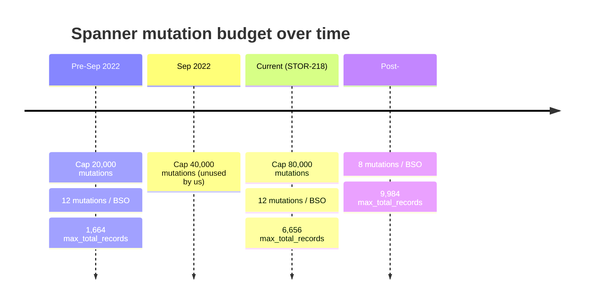
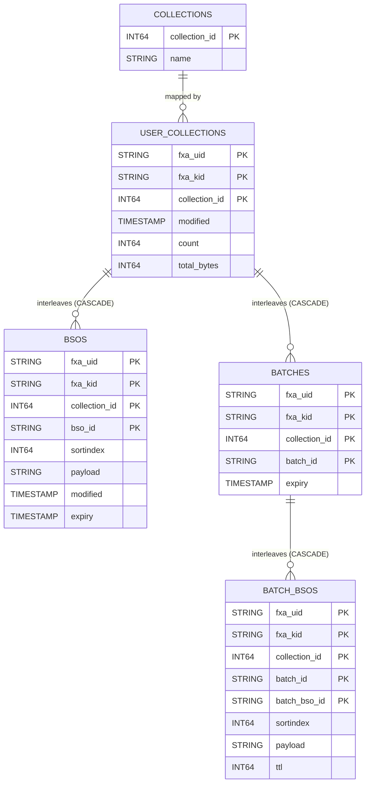

# Syncstorage Spanner Backend

Spanner is the production backend for Syncstorage-rs. This page documents the schema layout, batch commit flow, and the per-commit mutation budget.

## Tables Overview

| Table              | Description                                                                                                  |
| ------------------ | ------------------------------------------------------------------------------------------------------------ |
| `user_collections` | Per-user metadata about each collection (modified time, record count, total bytes). Parent of `bsos`/`batches` via `INTERLEAVE IN PARENT`. |
| `bsos`             | Stores Basic Storage Objects, (BSOs) the synced records. Interleaved in `user_collections`.                |
| `collections`      | Maps collection names to stable IDs.                                                                         |
| `batches`          | Temporary staging row per in-progress batch upload. Interleaved in `user_collections`.                       |
| `batch_bsos`       | BSOs belonging to a batch, pending commit. Interleaved in `batches`.                                         |

All `bsos` and `batches` rows are physically co-located with their `user_collections` parent. Spanner's interleaving puts a user's collection metadata, BSOs, and pending batches on the same split. `ON DELETE CASCADE` from `batches` to `batch_bsos` and `user_collections` `bsos`/`batches` means parent deletes wipe descendants atomically.

## Configuration

All settings live in `syncstorage-settings::Settings` (`syncstorage-settings/src/lib.rs`) and are configurable via TOML (under `[syncstorage]` / `[syncstorage.limits]`) or environment variables (`SYNC_SYNCSTORAGE__*` / `SYNC_SYNCSTORAGE__LIMITS__*`). The full env-var inventory lives in [Application Configuration](../config.md); this section calls out what is Spanner-specific or behaves differently under Spanner.

### Connection & pool

| Setting                                | Default     | Spanner role                                                                                              |
| -------------------------------------- | ----------- | --------------------------------------------------------------------------------------------------------- |
| `database_url`                         | (required)  | Must use `spanner://projects/
/instances/<I>/databases/<D>` to select the Spanner backend.              |
| `database_pool_max_size`               | 10          | Max sessions per worker held by the Spanner connection pool.                                              |
| `database_pool_connection_timeout`     | 30 s        | How long a request waits for a session before failing.                                                    |
| `database_pool_connection_lifespan`    | None        | Max age before a session is rotated. Helps shed sessions stuck on a degraded node.                        |
| `database_pool_connection_max_idle`    | None        | Max idle time before a session is reaped by the sweeper task.                                             |
| `database_pool_sweeper_task_interval`  | 30 s        | How often the background sweeper runs (Spanner-only).                                                     |

### Spanner-specific flags

| Setting                              | Default | Effect                                                                                                                                                                                  |
| ------------------------------------ | ------- | --------------------------------------------------------------------------------------------------------------------------------------------------------------------------------------- |
| `database_spanner_route_to_leader`   | false   | When true, sets the `x-goog-spanner-route-to-leader` header on read-write transactions so they route directly to the leader replica. Reduces write latency at the cost of less load-spreading. |
| `spanner_emulator_host`              | None    | If set (e.g., `localhost:9010`), the Spanner client connects to the local emulator over plaintext gRPC and skips token-based auth. Used by `make run_spanner` and integration tests.    |

### Server limits

Set under `[syncstorage.limits]` in TOML, or as `SYNC_SYNCSTORAGE__LIMITS__*` env vars.

| Setting                    | Default                                  | Notes for Spanner                                                                                                                                                |
| -------------------------- | ---------------------------------------- | ---------------------------------------------------------------------------------------------------------------------------------------------------------------- |
| `max_post_bytes`           | 2,621,440 (2.5 MB)                       | Total payload bytes accepted in a single POST.                                                                                                                   |
| `max_post_records`         | 100                                      | BSO count for a single POST. Independent of `max_total_records`.                                                                                                 |
| `max_record_payload_bytes` | 2,621,440 (2.5 MB)                       | Per-BSO payload size ceiling.                                                                                                                                    |
| `max_request_bytes`        | 2,625,536 (≈ 2.5 MB + 4 KB)              | HTTP `Content-Length` ceiling also enforced upstream of the API (e.g., nginx).                                                                                  |
| `max_total_bytes`          | 250 MB declared, clamped                 | Combined batch payload size. **`Settings::normalize()` clamps this to `MAX_SPANNER_LOAD_SIZE` (100 MB) for Spanner deployments.**                                |
| `max_total_records`        | 10,000 default; 9,984 in Spanner prod    | BSOs per batch. The Spanner ceiling is driven by the per-commit mutation budget, see [below](#batch-commit-mutation-budget).                                    |
| `max_quota_limit`          | 2 GB                                     | Per-collection quota; only enforced when `enforce_quota = true`.                                                                                                  |

### Quota toggles

| Setting          | Default | Effect                                                                                                                                                              |
| ---------------- | ------- | ------------------------------------------------------------------------------------------------------------------------------------------------------------------- |
| `enable_quota`   | false   | Enables `count` / `total_bytes` tracking on `user_collections`. Adds 6 mutations per batch commit (Steps 1 & 4 in the budget below).                                |
| `enforce_quota`  | false   | When true, returns 403 once a user's collection exceeds `max_quota_limit`. When false but `enable_quota` is true, the server only logs a warning.                   |

`Settings::normalize()` forces `max_quota_limit = 0` and disables both quota flags for non-Spanner deployments, quota is a Spanner-only feature in this codebase.

### Compile-time constants

Not configurable at runtime, but material to Spanner behavior:

| Constant                  | Value                       | Location                            | Role                                                                                                                                  |
| ------------------------- | --------------------------- | ----------------------------------- | ------------------------------------------------------------------------------------------------------------------------------------- |
| `MAX_SPANNER_LOAD_SIZE`   | 100 MB                      | `syncserver-common/src/lib.rs`      | Hard ceiling on combined batch payload bytes; clamps `max_total_bytes` for Spanner.                                                   |
| `BATCH_LIFETIME`          | 2 hours                     | `syncstorage-db-common/src/lib.rs`  | Stale-batch GC window. New `batches` rows get `expiry = now + BATCH_LIFETIME`; Spanner's row deletion policy reaps anything older.    |
| `DEFAULT_BSO_TTL`         | 2,100,000,000 s (≈ 66.5 yr) | `syncstorage-db-common/src/lib.rs`  | Sentinel "never expire" TTL applied when a request doesn't specify one.                                                               |

### Spanner platform limits (for context)

These come from Spanner itself and bound what the server must respect:

| Platform limit              | Value     | How this code respects it                                                                                              |
| --------------------------- | --------- | ---------------------------------------------------------------------------------------------------------------------- |
| Mutations per commit        | 80,000    | `max_total_records` plus the batch-commit accounting in [the mutation budget section](#batch-commit-mutation-budget). |
| Combined data per commit    | ~100 MB   | `MAX_SPANNER_LOAD_SIZE` constant clamps `max_total_bytes` to keep the server inside this envelope.                     |
| Per-split storage           | 4 GB      | `max_quota_limit` default (2 GB) leaves significant margin.                                                            |

## User Collections Table

| Column          | Type           | Description                                                          |
| --------------- | -------------- | -------------------------------------------------------------------- |
| `fxa_uid`       | `STRING(MAX)`  | FxA user ID. PK (part 1).                                            |
| `fxa_kid`       | `STRING(MAX)`  | FxA key ID (`<mono_num>-<client_state>`). PK (part 2).               |
| `collection_id` | `INT64`        | Maps to a named collection. PK (part 3).                             |
| `modified`      | `TIMESTAMP`    | Last modification time (server-assigned, updated on writes).         |
| `count`         | `INT64`        | Count of BSOs in this collection (quota mode only).                  |
| `total_bytes`   | `INT64`        | Total payload size of all BSOs (quota mode only).                    |

Enables `/info/collections`, `/info/collection_counts`, and `/info/collection_usage`.

## BSOs Table

| Column          | Type           | Description                                                          |
| --------------- | -------------- | -------------------------------------------------------------------- |
| `fxa_uid`       | `STRING(MAX)`  | FxA user ID. PK (part 1), FK to `user_collections`.                  |
| `fxa_kid`       | `STRING(MAX)`  | FxA key ID. PK (part 2), FK to `user_collections`.                   |
| `collection_id` | `INT64`        | PK (part 3), FK to `user_collections`.                               |
| `bso_id`        | `STRING(MAX)`  | Unique ID within a collection. PK (part 4).                          |
| `sortindex`     | `INT64`        | Indicates record importance for syncing (optional).                  |
| `payload`       | `STRING(MAX)`  | Payload bytes (e.g. an encrypted JSON blob). `NOT NULL`.             |
| `modified`      | `TIMESTAMP`    | Server-assigned modification timestamp.                              |
| `expiry`        | `TIMESTAMP`    | Absolute expiration time. Spanner's row deletion policy prunes rows older than `expiry`. |

`INTERLEAVE IN PARENT user_collections ON DELETE CASCADE`.

### Secondary indexes (historical)

The `bsos` table previously carried two interleaved secondary indexes — `BsoModified` and `BsoExpiry` — covering modified-descending sort and TTL-based queries respectively. Both were removed in [PR #2382](https://github.com/mozilla-services/syncstorage-rs/pull/2382) (STOR-111) after the queries that depended on them were retired. Their removal cut the per-BSO mutation cost in the batch commit from 12 to 8 — see the [mutation budget evolution](#mutation-budget-evolution) below.

## Collections Table

| Column          | Type          | Description                       |
| --------------- | ------------- | --------------------------------- |
| `collection_id` | `INT64`       | Primary key.                      |
| `name`          | `STRING(32)`  | Collection name, must be unique (`CollectionName` unique index). |

### Standard Collections

The 13 standard collections expected by clients have fixed reserved IDs (1–13). Custom collections start at 100. See `syncstorage-spanner/src/schema.ddl` and `insert_standard_collections.sql` for the migration source of truth, and the Postgres page for the full reserved-ID table.

## Batches Table

| Column          | Type           | Description                                                                                 |
| --------------- | -------------- | ------------------------------------------------------------------------------------------- |
| `fxa_uid`       | `STRING(MAX)`  | PK (part 1), FK to `user_collections`.                                                      |
| `fxa_kid`       | `STRING(MAX)`  | PK (part 2), FK to `user_collections`.                                                      |
| `collection_id` | `INT64`        | PK (part 3), FK to `user_collections`.                                                      |
| `batch_id`      | `STRING(MAX)`  | UUID (simple form), assigned server-side. PK (part 4).                                      |
| `expiry`        | `TIMESTAMP`    | Time at which a stale batch is discarded. Spanner's row deletion policy prunes after this.  |

`INTERLEAVE IN PARENT user_collections ON DELETE CASCADE`.

## Batch BSOs Table

| Column          | Type           | Description                                                            |
| --------------- | -------------- | ---------------------------------------------------------------------- |
| `fxa_uid`       | `STRING(MAX)`  | PK (part 1), FK to `batches`.                                          |
| `fxa_kid`       | `STRING(MAX)`  | PK (part 2), FK to `batches`.                                          |
| `collection_id` | `INT64`        | PK (part 3), FK to `batches`.                                          |
| `batch_id`      | `STRING(MAX)`  | PK (part 4), FK to `batches`.                                          |
| `batch_bso_id`  | `STRING(MAX)`  | Unique ID within a batch. PK (part 5).                                 |
| `sortindex`     | `INT64`        | Optional; nullable since the upload may not set every field per item.  |
| `payload`       | `STRING(MAX)`  | Optional; nullable for the same reason.                                |
| `ttl`           | `INT64`        | Time-to-live in seconds, optional.                                     |

`INTERLEAVE IN PARENT batches ON DELETE CASCADE`. Note there is no `modified` column, the modification timestamp is assigned at commit time when rows are upserted into `bsos`.

## Batch commit mutation budget

This section is the canonical reference for the per-commit mutation budget on Spanner. The math below reflects the current code: the post-STOR-218 single-upsert commit path (`batch_commit_upsert.sql`) running against the post-[#2382](https://github.com/mozilla-services/syncstorage-rs/pull/2382) `bsos` schema with no secondary indexes.

### Mutation primer

Spanner does not count "rows written," it counts **column writes inside a single committed transaction**. A few things are easy to under-count:

- **Key columns count.** An INSERT of a row with a 4-column primary key writes 4 mutations before any payload column is counted.
- **Secondary index entries count.** Each non-interleaved index is a separate "mutation source" modifying an indexed column causes a delete-then-insert on the index entry (2 mutations per affected index).
- **Both write paths share the budget.** DML statements (`UPDATE ... WHERE`, `INSERT OR UPDATE`, `INSERT ... SELECT`) and the Mutation API (`InsertOrUpdate`, etc.) both consume the same per-commit budget.
- **Hitting the cap is a hard failure**, not a slowdown, `FAILED_PRECONDITION: The transaction contains too many mutations`.

### Limit history

| Era                | Per-commit mutation cap | Notes                                                                                  |
| ------------------ | ----------------------- | -------------------------------------------------------------------------------------- |
| Original (~2022)  | 20,000                  | Drove the original `max_total_records = 1666` ceiling.                                 |
| Sep 27, 2022       | 40,000                  | [Spanner release notes](https://cloud.google.com/spanner/docs/release-notes#September_27_2022). |
| Current            | 80,000                  | [Cloud Spanner doubles the number of updates per transaction](https://cloud.google.com/blog/products/databases/cloud-spanner-doubles-the-number-of-updates-per-transaction). |

The current 80,000 limit is in effect for all Spanner instances, no opt-in required.

### Commit flow

`commit_batch` (`syncstorage-spanner/src/db/batch_impl.rs`) wraps a single Spanner transaction containing four steps:

1. **`update_collection`** upsert the `user_collections` parent row. Required because `bsos` and `batches` are `INTERLEAVE IN PARENT user_collections` and Spanner requires the parent row exist before child writes.
2. **`INSERT OR UPDATE INTO bsos`** (single DML, `batch_commit_upsert.sql`): drains `batch_bsos` for this batch into `bsos`. The upsert preserves prior values for any column the client did not supply (via `LEFT JOIN ... COALESCE`).
3. **`delete_batch`** `DELETE FROM batches WHERE ...`. The `ON DELETE CASCADE` on `batch_bsos` removes the staging rows as part of the same operation.
4. **`update_user_collection_quotas`** (quota mode only): refresh `count` and `total_bytes` on `user_collections`.

### Per-step mutation accounting

#### Step 1 `update_collection` parent upsert

INSERT or UPDATE of one `user_collections` row:

| Mode       | Mutations | Breakdown                                                          |
| ---------- | --------- | ------------------------------------------------------------------ |
| quota off  | 4         | 3 PK columns + 1 non-PK (`modified`).                              |
| quota on   | 6         | 3 PK columns + 3 non-PK (`modified`, `count`, `total_bytes`).      |

#### Step 2 `INSERT OR UPDATE INTO bsos`

With no secondary indexes on `bsos` (per [#2382](https://github.com/mozilla-services/syncstorage-rs/pull/2382)), the upsert pays only the base-row cost — identical on the insert and update paths:

| Component                                                       | Mutations |
| --------------------------------------------------------------- | --------- |
| 4 PK columns (`fxa_uid`, `fxa_kid`, `collection_id`, `bso_id`)  | 4         |
| 4 non-PK columns (`sortindex`, `payload`, `modified`, `expiry`) | 4         |
| **Total per BSO**                                               | **8**     |

For `N` BSOs in the batch: `8N` mutations.

#### Step 3 `delete_batch`

DELETE of one `batches` row: **1 mutation**. The cascaded `batch_bsos` rows ride along with the parent delete and don't move the budget here in our measurements.

#### Step 4 `update_user_collection_quotas` (quota on only)

UPDATE of one `user_collections` row: **6 mutations** (3 PK + 3 non-PK columns).

### Totals and ceiling

| Mode       | Formula              | At N = 9,984        | Headroom (80,000 − total) |
| ---------- | -------------------- | ------------------- | ------------------------- |
| quota off  | `4 + 8N + 1`         | 79,877              | 123                       |
| quota on   | `6 + 8N + 1 + 6`     | 79,885              | 115                       |

Solving `8N + 13 <= 80,000` (quota on, the binding constraint) gives `N <= 9,998`. The deployed value is the more conservative **9,984** — which equals `6,656 × (12 / 8)` (the previous chosen value scaled by the per-BSO cost ratio) and equals `1,664 × 6` (the legacy 1,664 scaled by the combined cap-and-index gains since 2022). It holds total mutations at exactly **79,885** — identical to the pre-#2382 configuration at 6,656 — and leaves the same 115-mutation absolute headroom, with 14 BSOs of slack vs. the 9,998 ceiling.

### Mutation budget evolution

Three-way comparison, quota-on path (the binding constraint):

|                                  | Legacy (≤ 2022)        | Pre-#2382 (STOR-218 in place) | Current (post-#2382)      |
| -------------------------------- | ---------------------- | ----------------------------- | ------------------------- |
| Spanner per-commit cap           | 20,000                 | 80,000                        | 80,000                    |
| Secondary indexes on `bsos`      | `BsoModified`, `BsoExpiry` | `BsoModified`, `BsoExpiry` | none                      |
| Per-BSO mutation cost            | 12                     | 12                            | **8**                     |
| Formula (quota on)               | `12N + 13 ≤ 20,000`    | `12N + 13 ≤ 80,000`           | `8N + 13 ≤ 80,000`        |
| Mathematical ceiling             | 1,665                  | 6,665                         | 9,998                     |
| Chosen `max_total_records`       | **1,664**              | **6,656**                     | **9,984**                 |
| Mutations consumed at chosen `N` | 19,981                 | 79,885                        | 79,885                    |
| Headroom under cap               | 19                     | 115                           | 115                       |

Capacity has grown ~6× since 2022 — first 4× from the Spanner cap raise (20k → 80k), then another 1.5× from the secondary-index removal (12 → 8 mutations per BSO) — while the absolute headroom under the cap has stayed effectively constant.

### Justification

- **Why not 9,998 (the math ceiling)?** 14 BSOs of slack is operationally negligible client-side, but the buffer absorbs minor Spanner accounting drift or a +1-mutation fixed-overhead schema change (e.g., a new column on `user_collections`) without an emergency config bump.
- **Why 9,984 specifically?** It holds total mutations at exactly **79,885** — identical to the prior 6,656/12-mut configuration. The value drops out cleanly as `6,656 × (12 / 8) = 9,984` (per-BSO cost ratio) and as `1,664 × 6 = 9,984` (total scaling since 2022). Same absolute 115-mutation headroom.
- **What headroom does NOT protect against.** Adding a column or a new index to `bsos` would scale per-BSO cost across all `N` rows and requires a fresh recalculation; the 115-mutation buffer only absorbs fixed-overhead changes and small accounting drift, not anything that multiplies `N`.

### Env var

`max_total_records` is set in production via the `SYNC_SYNCSTORAGE__LIMITS__MAX_TOTAL_RECORDS` environment variable. The standalone-server default in `syncstorage-settings/src/lib.rs` is 10,000 and applies to non-Spanner backends; the Spanner production deployment always overrides it.

`config/local.example.toml` carries the recommended Spanner dev value for the local emulator stack.

### Why `INSERT OR UPDATE` is safe at this scale

The pre-STOR-218 implementation issued two DML statements per commit (`UPDATE` for existing rows, then `INSERT INTO ... SELECT` for the remainder) with a pre-scan to bucket rows. The current single-statement upsert simplifies the code path without changing the mutation accounting: with both secondary indexes removed (per [#2382](https://github.com/mozilla-services/syncstorage-rs/pull/2382)), the upsert pays only base-row mutations (4 PK + 4 non-PK = 8), and that cost is identical on the insert and update paths.

## Database Diagram and Relationship

