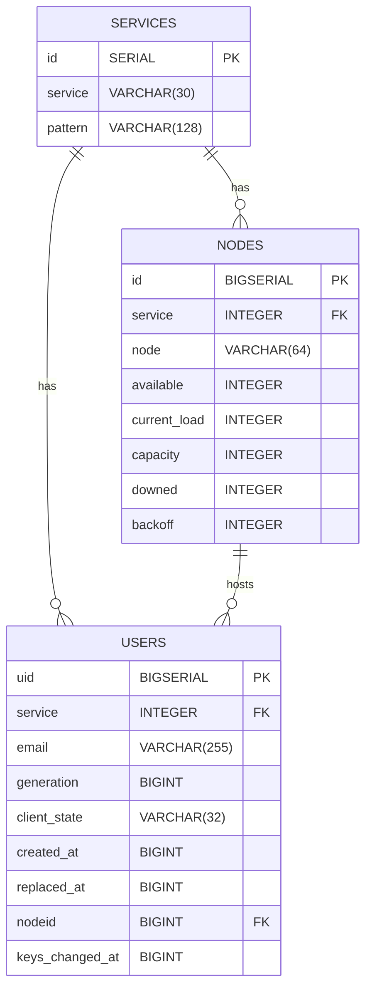

# Tokenserver - Postgres Database Implementation

## General Data Model
The core of the Tokenserver's data model is a table named `users` that maps each user to their storage
node, and that provides enough information to update that mapping over time.  Each row in the table
contains the following fields:

* `uid`: Auto-incrementing numeric userid, created automatically for each row.
* `service`: The service the user is accessing; in practice this is always `sync-1.5`.
* `email`: Stable identifier for the user; in practice this is always `<fxa_uid>@api.accounts.firefox.com`.
* `nodeid`: The storage node to which the user has been assigned.
* `generation`: A monotonically increasing number provided by the FxA server, indicating
                the last time at which the user's login credentials were changed.
* `client_state`: The hash of the user's sync encryption key.
* `keys_changed_at`: A monotonically increasing timestamp provided by the FxA server, indicating
                     the last time at which the user's encryption keys were changed.
* `created_at`: Timestamp at which this node-assignment record was created.
* `replaced_at`: Timestamp at which this node-assignment record was replaced by a newer assignment, if any.

This table contains some unnecessarily general names; these are a legacy of earlier plans
to re-use Tokenserver for multiple Mozilla services and with multiple identity providers.

The `generation` column is used to detect when the user's FxA credentials have been changed
and to lock out clients that have not been updated with the latest credentials.
Tokenserver tracks the highest value of `generation` that it has ever seen for a user,
and rejects a number is less than that high-water mark. This was used previously with BrowserID.
However, OAuth clients do not provide a `generation` number, because OAuth tokens get revoked immediately when the user's credentials are changed.

The `client_state` column is used to detect when the user's encryption key changes.
When it sees a new value for `client_state`, Tokenserver will replace the user's node assignment
with a new one, so that data encrypted with the new key will be written into a different
storage "bucket" on the storage nodes.

The `keys_changed_at` column tracks the timestamp at which the user's encryption keys were
last changed. The OAuth client provides it as part of the `X-KeyID` header. Tokenserver will check that changes in the value
of `keys_changed_at` always correspond to a change in `client_state`, and will use this pair of
values to construct the `fxa_kid` field that is communicated to the storage nodes.

When replacing a user's node assignment, the previous column is not deleted immediately.
Instead, it is marked as "replaced" by setting the `replaced_at` timestamp, and then a background
job periodically purges replaced rows (including making a `DELETE` request to the storage node
to clean up any old data stored under that `uid`).

For this scheme to work as intended, it's expected that storage nodes will index user data by either:

1. The tuple `(fxa_uid, fxa_kid)`, which identifies a consistent set of sync data for a particular
   user, encrypted using a particular key.
2. The numeric `uid`, which changes whenever either of the above two values change.

## Tables
We have three database tables:

- `services`: lists the available services and their endpoint-url pattern.
- `nodes`: lists the nodes available for each service.
- `users`: lists the user records for each service, along with their metadata and current node assignment.

## Services Table
This table lists all the available services and their endpoint patterns.

Service names are expected to be `"{app_name}-{app_version}"` for example
`"sync-1.5"`.

Having a table for these means that we can internally refer to each service
by an integer key, which helps when indexing by service.

| Column    | Type           | Description                                                                    |
| --------- | -------------- | ------------------------------------------------------------------------------ |
| `id`      | `SERIAL`          | Primary key for the service. Auto-increments with each new entry.              |
| `service` | `VARCHAR(30)`  | A short name or identifier for the service (e.g., `sync-1.5`). Must be unique. |
| `pattern` | `VARCHAR(128)` | An optional pattern string for URI templating (e.g., `"{node}/1.5/{uid}"`).    |

## Nodes Table
This table keeps tracks of all nodes available per service.

Each node has a root URL as well as metadata about its current availability and capacity.

| Column          | Type          | Description                                                               |
| -------------- | ------------- | ------------------------------------------------------------------------- |
| `id`           | `BIGSERIAL`   | Primary key, auto-incrementing unique node identifier                     |
| `service`      | `INTEGER`     | References a service |
| `node`         | `VARCHAR(64)` | Unique node name under a given service                                    |
| `available`    | `INTEGER`     | Number of free slots currently available on node. |
| `current_load` | `INTEGER`     | Number of active users/sessions assigned to node. |
| `capacity`     | `INTEGER`     | Max allowed capacity, measured by number of users allowed to be assigned to node.              |
| `downed`       | `INTEGER`     | Flag indicating whether node is in service.|
| `backoff`      | `INTEGER`     | Throttling level for the node.  |
 
 ### Notes
 Regarding constraint clause that defines composite key/index:
 - Each service (sync-1.5, sync-1.1, etc.) has a set of distinct nodes.
 - Node names can repeat across services, but not within a single service.

## Users Table
This table associates email addresses with services via integer uids.
A user is uniquely identified by their email.  For each service they have a uid,
an allocated node, and last-seen generation and client-state values.

| Column        | Type           | Description                                                    |
| ----------------- | -------------- | -------------------------------------------------------------- |
| `uid`             | `BIGINT`       | Unique identifier for the user (primary key), auto-incremented |
| `service`         | `INT`          | Service ID 
| `email`           | `VARCHAR(255)` | User's email address; `<fxa_uid>@api.accounts.firefox.com`                                           |
| `generation`      | `BIGINT`       | Versioning or generation for user updates based on login credential change.                      |
| `client_state`    | `VARCHAR(32)`  | State of the client; hash of sync key.         |
| `created_at`      | `BIGINT`       | Timestamp when user was created                                |
| `replaced_at`     | `BIGINT`       | Timestamp when user was replaced                     |
| `nodeid`          | `BIGINT`       | ID of the node where the user is hosted                        |
| `keys_changed_at` | `BIGINT`       | Timestamp of last key change, based on FxA server timestamp.                         |

### Notes
Notes on created indexes:

| Index Name        | Columns Indexed                    | Type      | Purpose                                                        |
| ----------------- | ---------------------------------- | --------- | -------------------------------------------------------------- |
| `lookup_idx`      | (`email`, `service`, `created_at`) | Composite | Speeds up user lookups, through composite key |
| `replaced_at_idx` | (`service`, `replaced_at`)         | Composite | Optimizes queries on soft-deleted or replaced users            |
| `node_idx`        | (`nodeid`)                         | Single    | Helps locate users hosted on a specific backend node           |


#### `lookup_idx`
- This is a composite index on three columns: `email`, `service`, and `created_at`.
- Leftmost prefix rule applies. The index will be used efficiently for:
```sql
WHERE email = ?

WHERE email = ? AND service = ?

WHERE email = ? AND service = ? AND created_at = ?
```
- Allows fast filtering and sorting by created_at after narrowing down by email + service.

#### `replaced_at_idx`
- This index helps optimize queries that involve tracking user.replacement events, such as soft deletions, archival, or data rollover.
- Efficient for filtering by service alone or service + replaced_at.
- Helps locate "active" vs "replaced" users quickly.

#### `node_idx`
- This index is on `nodeid`, which identifies the node hosting the user’s data, improving lookups.

## Mermaid Diagram of Tokenserver DB Relations

