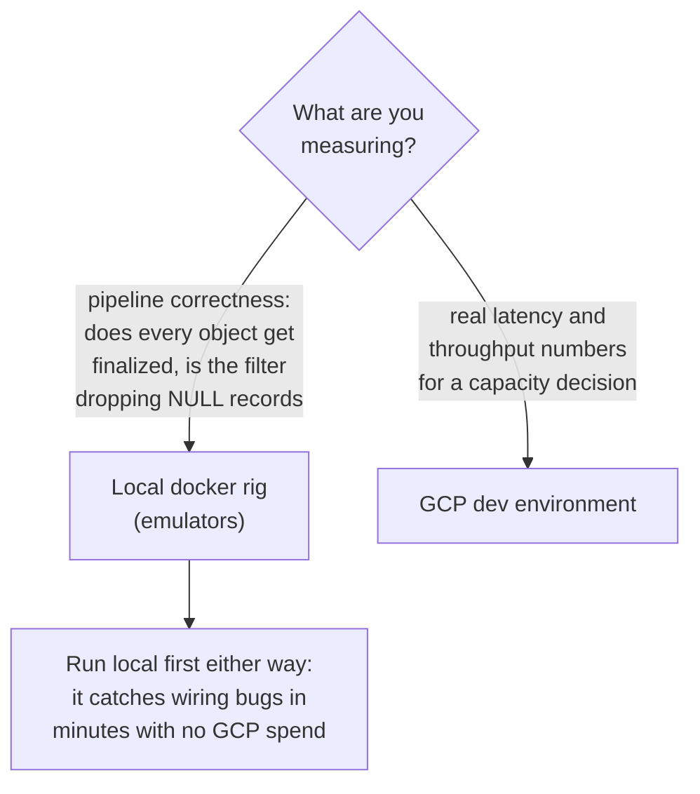
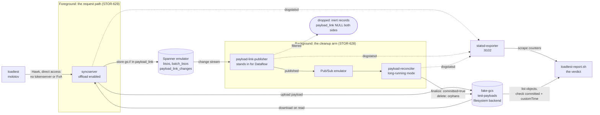
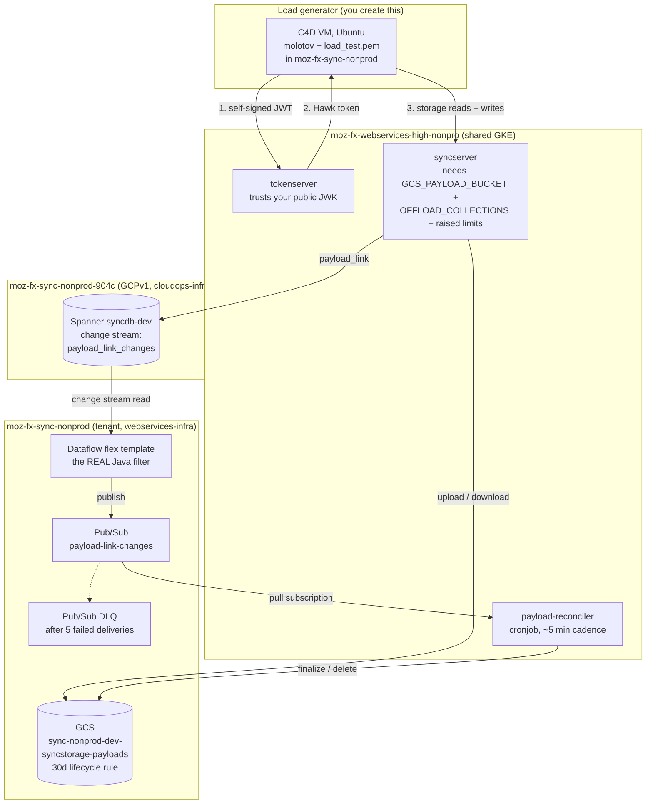

# Load Testing

## Quickstart: load test the change stream system (STOR-628)

Four commands. Needs Docker, plus `curl` and `jq`. No GCP account, no
credentials, no VM.

```console
make loadtest-offload-image          # once: builds the server image
make loadtest-offload-changestream   # run the load test
make loadtest-offload-report         # did the pipeline keep up?
make loadtest-offload-down           # tear it all down
```

The report is the answer. Three numbers matter:

| Look for | Meaning |
| --- | --- |
| `filtered` non-zero | The pipeline correctly dropped change records that have no payload file attached. This is the thing STOR-628 is asking about. |
| `handler errors` zero | Nothing failed while finalizing or deleting objects. |
| `noop_skips` zero | Nothing inert slipped past the filter. |

It prints `OK: pipeline drained clean` at the end, or a list of `FAIL` lines
explaining what went wrong, and exits non-zero on a real problem so it can gate
a script.

One thing to expect: a `NOTE` saying `batch_commit_skips` is 0. That is a known
emulator limitation rather than your run going wrong. See
[The emulator drops transaction tags](#the-emulator-drops-transaction-tags).

For a real run rather than a smoke test, pass molotov your own arguments:

```console
make loadtest-offload-changestream \
  MOLOTOV_ARGS="--processes 2 --workers 20 --duration 3600 -v"
```

To load test the handler read/write path instead (STOR-629), swap in
`make loadtest-offload-handler`. Same report, same teardown.

Everything below is detail you only need when a run looks wrong, or when you
need real latency numbers and have to go to GCP.

---

## Summary

This is the runbook for load testing syncstorage, with the offloaded-payload
pipeline as the main case. It replaces the Confluence page "Syncstorage &
Tokenserver Runbooks", whose molotov and locust instructions had become
interleaved and unreadable.

There are two load tests in the repo and they are unrelated:

| | Target | Tool | Location |
| --- | --- | --- | --- |
| Syncstorage | storage read/write API | molotov | `tools/syncstorage-loadtest/` |
| Tokenserver | `/1.0/sync/1.5` token issuance | locust | `tools/tokenserver/loadtests/` |

Everything below is about the syncstorage/molotov one unless it says otherwise.
For tokenserver, see [Tokenserver load tests](#tokenserver-load-tests-locust).

Two tickets drive the offload work, and they want different traffic shapes:

| Ticket | Goal | Traffic shape |
| --- | --- | --- |
| STOR-629 | Performance of the handler's GCS read/write path | 100% offloaded, every payload expanded |
| STOR-628 | The change stream to reconciler pipeline, including the filtering of NULL `payload_link` records | Mixed offloaded and inline |

The distinction matters. STOR-628 is only a real test if some writes are
*not* offloaded, because the record it is checking for is the one the
publisher's filter is supposed to drop.

---

## Which rig to use



The local rig runs the whole pipeline on emulators. It is the right default:
it needs no GCP project, no credentials and no VM, and it answers every
correctness question. What it cannot give you is a trustworthy latency
number, because fake-gcs-server on a loopback interface is nothing like GCS
over the network, and the Spanner emulator is single-node and in-process.

Use GCP dev when the question is "how fast" rather than "does it work".

---

## Local docker rig

### What it stands up

The rig is the existing reconciliation e2e stack plus a molotov container and
a metrics sink. Compose overlay: `docker/docker-compose.loadtest.yaml`.



The two halves map onto the two tickets. Everything left of the change stream
is STOR-629's territory, and it costs the user latency. Everything right of it
is STOR-628's, and no user waits on it, but a wrong decision there deletes a
file a live row still needs.

Note where the report gets its evidence: counters from the statsd sink, and
object state read straight out of the bucket. It never trusts molotov's exit
status, because the cleanup arm runs after the response is sent and can fail
long after the client saw a 200.

| Service | Role |
| --- | --- |
| `sync-db` | Spanner emulator, carrying the `payload_link_changes` change stream from `schema.ddl` |
| `pubsub-emulator` | Pub/Sub |
| `fake-gcs` | GCS, on its **filesystem** backend for this rig |
| `reconciliation-setup` | One-shot: creates the topic, subscription and bucket |
| `payload-link-publisher` | Python change-stream reader, stands in for the Dataflow job |
| `payload-reconciler` | Drains Pub/Sub, finalizes and deletes GCS objects |
| `syncserver` | Offload enabled, limits raised |
| `statsd` | `prom/statsd-exporter`, so the publisher and reconciler counters are readable |
| `loadtest` | molotov |

The publisher is the Python one, not the Java Dataflow template. It publishes
the identical JSON wire format, so everything downstream of it is
production code. If you need to reproduce something Java-specific, layer
`docker-compose.e2e.reconciliation.java.yaml` on top; see
[Reconciliation Pipeline](payload_link_reconciler.md).

On the NULL-filtering half of STOR-628, be precise about what the local rig
proves. The filter exists twice: `isPayloadLinkActionable` in the Java flex
template, and `is_payload_link_actionable` in
`payload-link-publisher-py/utils.py`, which is written to mirror it. A local
run exercises the **Python** one. That is a real test of the filter's logic
and of everything downstream, but it is not a test of the Java code that runs
in production. To exercise the shipping filter, either use the Java overlay
locally or run against GCP dev, where the Dataflow job is the publisher.

### Prerequisites

- Docker running, with roughly 8 GB available to the VM. Expanded payloads
  are held in memory in several places at once.
- `curl` and `jq` on the host, for the report script.
- Nothing else. No GCP credentials, no `service-account.json`.

### The stale publisher image trap

Read this before trusting any local result.

`payload-link-publisher` is the only service in the stack built from a compose
`build:` context rather than pulled or shared with `app:build`. Plain
`docker compose up` reuses whatever `docker-payload-link-publisher` image is
already in your local cache and **will not rebuild it when its source
changes**. So a publisher image built before a change to
`payload-link-publisher-py/` keeps running against new server code, silently.

This is not hypothetical. It is how the rig behaved on first use here: a
four-week-old publisher image had no `transaction_tag` support at all, so no
record ever carried the `batch_commit` tag, so the reconciler treated every
batch-commit handoff as a genuine `batch_bsos` removal and deleted GCS objects
that committed `bsos` rows still pointed at. The symptom was HTTP 500s on
reads, `payload_reconciler.batch_commit_skips` flat at zero, and
`gcs_404{op=finalize}` running nearly 1:1 with `finalizes`. It looked exactly
like the STOR-657 production bug, and it was entirely a stale image.

The `loadtest-offload-*` targets therefore pass `--build` on every `up`. The
first build is slow from a cold cache; afterwards it is cached and cheap.

Two things follow. If you drive compose by hand instead of through the
Makefile, pass `--build` yourself. And note that
`make docker_run_reconciliation_e2e_tests` does **not** pass it, so a local run
of the reconciliation e2e suite can exercise a stale publisher. CI is unaffected
because its cache starts empty.

The tell, if you suspect it:

```console
docker compose ... exec payload-link-publisher grep -c transaction_tag /app/publisher.py
```

Zero means the image predates transaction-tag support.

### Run it

```console
make loadtest-offload-image           # build app:build (spanner backend), once

make loadtest-offload-handler         # STOR-629
make loadtest-offload-report

make loadtest-offload-changestream    # STOR-628
make loadtest-offload-report

make loadtest-offload-down            # tear down, including the fake-gcs volume
```

`loadtest-offload-report` waits for the reconciler to stop making progress
before reporting, so run it straight after the load test rather than trying
to guess a sleep. It exits non-zero if it finds a problem, which makes it
usable as a gate.

Both scenario targets take `MOLOTOV_ARGS`:

```console
make loadtest-offload-handler MOLOTOV_ARGS="--processes 2 --workers 20 --duration 600 -v"
```

Start small. Every worker can be holding a multi-MiB payload, on both the
client and the server, so worker count multiplies memory rather than just CPU.
Five workers writing 10 MiB records is already a meaningful amount of traffic
through this stack.

### Reading the report

```text
RECONCILER (payload_reconciler.*)
  payload_reconciler_finalizes 1843
  payload_reconciler_orphan_deletes 291
  payload_reconciler_batch_commit_skips 412
...
GCS OBJECTS (test-payloads)
  objects           1552
  committed=true    1552
  committed!=true   0
  customTime pinned 1552
...
VERDICT
  OK: pipeline drained clean.
```

What each number should look like:

| Metric | Healthy | If it is wrong |
| --- | --- | --- |
| `published` | Tracks actionable change records | Zero means the publisher is not reading the change stream at all |
| `filtered` | **Non-zero on a mixed run.** This is the positive evidence for STOR-628: the publisher dropped records with `payload_link` NULL on both sides | Zero on a mixed run means either the filter is passing inert records through, or every write happened to be offloaded and the path went untested |
| `finalizes` | Tracks offloaded write volume | Zero with objects in the bucket means the change stream, publisher or Pub/Sub leg is broken |
| `orphan_deletes` | Non-zero, tracks overwrites and deletes | Zero means the load test never deleted anything; check `DISABLE_DELETES` |
| `batch_commit_skips` | **Zero on the local rig** -- see the emulator limitation below. Non-zero is what you require on GCP dev | Zero on *GCP dev* means the transaction tag is not reaching the change stream, which is the STOR-657/668 bug class |
| `noop_skips` | **Zero** | Non-zero is the STOR-628 regression: the filter let through a record with `payload_link` NULL on both sides |
| `errors kind:handler` | **Zero** | Non-zero means messages went unacked. In prod five failures on one message routes it to the DLQ |
| `committed!=true` | Zero once drained | A small tail is normal if you cut the run off mid-flight. A large or growing count means the pipeline is not keeping up with the write rate |

`committed=true` count and `customTime pinned` count must agree. Finalize sets
both in a single `blob.patch()`, so a divergence means something other than
the reconciler is writing object metadata.

One thing that surprises people: even the "100% offloaded" STOR-629 run
produces a non-zero `filtered` count. `OFFLOAD_COLLECTIONS` only governs the
batch-write arm, while the load test also PUTs `meta/global` and POSTs
`clients` on every scenario pass. Those two are never in the offload list, so
they generate exactly the inert NULL-on-both-sides records the filter is
there to drop. So STOR-629 covers the filter incidentally, and STOR-628 is
still the run that covers it deliberately, at volume, alongside offloaded
traffic in the same stream.

### Reading the 404 counters, and why they are the whole signal

The reconciler treats `404 NotFound` as success on both of its operations.
From `reconcile_payload_links.py`, a finalize whose target is gone logs at
`debug`, bumps `gcs_404{op=finalize}`, and **acks the message**. Same shape for
delete. [Reconciliation Pipeline](payload_link_reconciler.md) states the
rationale plainly: "Both reconciler actions are idempotent, so a redelivered
record is harmless."

That is correct and deliberate, and it has a consequence worth internalising
before you read a load test result. Because a missing object is success, a run
that is silently destroying data produces:

- `errors` `kind:handler` at **zero**
- nothing in the DLQ
- no `WARN` or `ERROR` in the reconciler log, only `debug`
- an elevated `gcs_404` counter, and nothing else

So on the offload path `gcs_404{op=finalize}` is not a nice-to-have gauge. It
is the *only* signal that separates a healthy pipeline from one that is
deleting live payloads. Everything else looks green.

That existing doc's failure-modes table gives two causes for a sustained
`gcs_404{op=finalize}`:

| Documented cause | Applies to a local run? |
| --- | --- |
| The lifecycle rule reclaimed the object before it was finalized | **No.** The 30 day `daysSinceCustomTime` rule is a bucket policy in `bucket.tf`. fake-gcs has no lifecycle policy at all, so nothing can reap an object locally. |
| The same message was redelivered after a successful prior run (the at-least-once tax) | **No**, not at volume. Redelivery is a background trickle, not a rate approaching `finalizes`. |

Measured on these runs, neither explains what was observed:

| Run | `finalizes` | `gcs_404{op=finalize}` | Ratio |
| --- | --- | --- | --- |
| STOR-629 handler | 930 | 716 | 77% |
| STOR-628 changestream | 1853 | 1589 | 86% |

A ratio near 1:1 is a third cause that the table does not list: **the
reconciler deleted the object itself**, as an orphan, and the finalize for that
same object then 404s. Locally that is the emulator dropping the
`batch_commit` transaction tag (see below), so every batch-commit handoff is
misread as a genuine `batch_bsos` removal.

The signature to recognise, wherever you see it:

```text
batch_commit_skips     0          <- tag never arrived
gcs_404{op=finalize}   ~= finalizes   <- finalizing objects already deleted
orphan_deletes         high       <- the deletes that did the damage
errors kind:handler    0          <- and nothing reports a problem
```

`gcs_404{op=delete}` is the benign one, and the existing doc's read of it holds
without qualification: the object was already gone, the operation is idempotent
by design, and a redelivery or a concurrent cleanup produces it. It carries no
data-loss implication on its own.

Two things follow for the alerting the reconciler doc already recommends. Its
suggestion to watch "`gcs_404` `op:finalize` rising as a share of `finalizes`"
is the right alert, and this gives it a concrete threshold to reason about: a
low single-digit share is the redelivery tax, while anything approaching
`finalizes` means objects are being deleted out from under committed rows. And
pairing it with `batch_commit_skips == 0` distinguishes the batch-commit cause
from a lifecycle-window problem.

### Knobs

Server side, set on the `syncserver` container:

| Variable | Default in the rig | Meaning |
| --- | --- | --- |
| `LOADTEST_OFFLOAD_COLLECTIONS` | `bookmarks,history` | Which collections syncserver offloads. **This is what decides mixed vs fully offloaded.** |
| `LOADTEST_COLLECTION_LIMITS` | 10 MiB record / 20 MiB post / 21 MiB request, for `bookmarks` and `history` only | Per-collection raised limits, as a JSON map. Keys must be a subset of the offload list -- see below |
| `LOADTEST_GCS_MAX_CONCURRENCY` | 4 | Concurrent GCS ops within one batch request. The main server-side throughput knob, worth sweeping |
| `LOADTEST_DB_POOL_MAX_SIZE` | 40 | The stock 10 saturates first once workers climb |

### Raise limits per collection, never globally

This is the one thing that will bite you, so it is worth stating plainly.

Spanner caps a single `STRING(MAX)` value at **2621440 bytes (2.5 MiB)**. That
hard cap is the reason this whole project exists. Raising the *global*
`max_record_payload_bytes` above it does not fail at the API, it fails in the
database, on every collection that is not offloaded:

```text
FAILED_PRECONDITION New value exceeds the maximum size limit for
this column: bsos.payload, size: 10485760, limit: 2621440
```

An offloaded collection is exempt, because its payload goes to GCS and the row
stores only a `gs://` URL in `payload_link`, leaving `payload` NULL. So a limit
above 2.5 MiB is only ever correct for a collection that is in
`gcs_payload_offload_collections`. That is exactly what the per-collection
override exists for, and how production raises it:

```console
SYNC_SYNCSTORAGE__LIMITS__COLLECTIONS='{"bookmarks":{"max_record_payload_bytes":10485760,"max_post_bytes":20971520,"max_request_bytes":22020096}}'
```

Leave the globals alone. Any collection not named in the map keeps stock
2.5 MiB behaviour and writes inline safely. `max_post_bytes` and
`max_request_bytes` are overridable per collection too; actix's payload config
is sized from the largest `max_request_bytes` across all overrides
(`ServerLimits::effective_max_request_bytes`), so a big body is not rejected at
the resource level before per-collection enforcement runs.

There is no per-collection `max_total_bytes`. The global default (clamped to
`MAX_SPANNER_LOAD_SIZE`, 100 MB, by `Settings::normalize` on spanner) is
already generous, so the rig leaves it untouched.

On a mixed run this arrangement gives you exactly the right traffic for free:
offloaded collections take expanded payloads, and inline collections get
`LARGE_PAYLOAD_PROB` applied but capped at 2.5 MiB by
`payload_target_length`, which is realistic "large but not offloaded" traffic.

Client side, set on the `loadtest` container:

| Variable | Meaning |
| --- | --- |
| `LARGE_PAYLOAD_PROB` | Fraction of BSOs given an expanded payload. `1.0` for STOR-629 |
| `LARGE_PAYLOAD_SIZE` | Explicit target size in bytes. Unset means "use the server's `max_record_payload_bytes`" |
| `OFFLOAD_COLLECTIONS` | Restricts batch writes to these collections. **Leave unset for mixed runs** |
| `DISABLE_DELETES` | Set truthy to suppress the DELETE arm. Leave off, or the reconciler's `orphan_deletes` branch is never exercised |

The two collection lists are easy to confuse:

- `LOADTEST_OFFLOAD_COLLECTIONS` (server) decides which collections get
  offloaded.
- `OFFLOAD_COLLECTIONS` (client) decides which collections get *written to*.

Setting the client one to a single collection sends every batch write there,
which is what you want for STOR-629 and exactly what you must not do for
STOR-628. For a mixed run, leave the client variable unset so writes spread
across molotov's default five (`bookmarks`, `forms`, `passwords`, `history`,
`prefs`) and set the server list to a subset of those.

### Per-collection limit overrides

Production raises limits for one collection rather than globally, via a JSON
map. The load test resolves limits per target collection out of
`/info/configuration`, preferring a collection's override, so this path is
covered too:

```console
SYNC_SYNCSTORAGE__LIMITS__COLLECTIONS='{"bookmarks":{"max_record_payload_bytes":20971520,"max_post_bytes":26214400,"max_request_bytes":26218496}}'
```

### Known limits of the local rig

- **The emulator does not carry transaction tags, so the batch-commit skip
  cannot be validated locally.** This one is load bearing; details below.
- **No DLQ.** `docker/reconciliation-setup.sh` creates the topic and
  subscription but no dead-letter topic, so dead-letter routing after five
  failed deliveries cannot be exercised locally. Verify that on GCP dev.
- **No Dataflow.** The Python publisher replaces the Java job. Autoscaling,
  partition-split handling under real load and the connector's Spanner
  metadata writes are all Dataflow behaviours that only appear on GCP.
- **Latency is not meaningful.** fake-gcs over loopback and a single-node
  Spanner emulator. Use it for correctness and relative comparisons only.
- **No lifecycle policy.** The 30 day `daysSinceCustomTime` rule that reaps
  unfinalized objects is a bucket policy, so the local rig can only check
  that `customTime` was pinned, not that the reaping behaves.

### The emulator drops transaction tags

The Spanner emulator emits the `transaction_tag` field on change stream
DataChangeRecords but never populates it. Measured on emulator v1.5.52: the
DataChangeRecord struct has arity 13, so index 11 (`transaction_tag`) exists
and the publisher reads it correctly, but every record carries the empty
string, including the `batch_bsos` DELETE that *is* the batch-commit handoff.

That single gap has a large consequence. The reconciler decides whether to keep
or delete a `batch_bsos` removal's object by checking
`transactionTag == "batch_commit"` (see
[Reconciliation Pipeline](payload_link_reconciler.md)). With the tag always
empty, every batch-commit handoff looks like a genuine removal, so the
reconciler deletes the GCS object that the just-committed `bsos` row now points
at. The BSO becomes unreadable and syncserver returns a 500 backed by a GCS 404.

So on the local rig, expect all of this, and do not read it as a regression:

- `payload_reconciler.batch_commit_skips` flat at zero.
- `gcs_404{op=finalize}` running close to 1:1 with `finalizes`.
- Objects missing for BSOs written in a batch create/append request.
- A residual molotov failure rate, because roughly 50% of its POST scenarios
  are transactional batches. Reads of those BSOs 500.

`docker/batch-commit-probe.py` reproduces it in isolation: one two-request
transactional batch, then a read of both BSOs, printing the bucket contents at
each stage.

```console
make loadtest-offload-up
SYNCSTORAGE_RS_IMAGE=app:build docker compose \
  -f docker/docker-compose.spanner.yaml \
  -f docker/docker-compose.e2e.spanner.yaml \
  -f docker/docker-compose.e2e.reconciliation.yaml \
  -f docker/docker-compose.e2e.jwk-cache.yaml \
  -f docker/docker-compose.loadtest.yaml \
  run --rm --entrypoint python3 \
  -v "$PWD/docker/batch-commit-probe.py:/probe.py:ro" loadtest /probe.py
```

Adding `--no-deps` to that command keeps the reconciler stopped, and the probe
then passes with both payloads intact. That is the control which proves the
reconciler is the thing deleting the object, rather than the batch commit
losing the `payload_link`.

What this does **not** tell you is whether production is affected. The app side
is correct: `handlers.rs` calls
`with_transaction_tag(BATCH_COMMIT_TRANSACTION_TAG)` on the commit path, and
real Spanner does record transaction tags on change streams. The evidence
points at an emulator gap rather than a code defect, but the local rig cannot
close that question. **Confirm the batch-commit skip on GCP dev**, where the
Dataflow job reads a real change stream: run the probe there and require
`payload_reconciler.batch_commit_skips` to be non-zero.

Two follow-ups worth filing rather than leaving implicit:

1. There is no e2e test for the batch-commit handoff.
   `tools/integration_tests/test_payload_link_reconciliation.py` covers upload,
   update and delete, but not a transactional batch. That is presumably because
   it cannot pass against the emulator, which is exactly the point: the gap is
   invisible in CI.
2. If the Java overlay behaves the same way, the emulator is confirmed as the
   cause. That is a cheap check and worth doing before spending GCP time.

---

## GCP dev environment

Use this for real numbers. The dev pipeline is fully provisioned; see
[GCP Infrastructure](payload-offload-infrastructure.md) for what lives where
and which repo owns it. That page is the authority on the resources
themselves. The diagram below is only the load-testing view: where the
generator sits, what it traverses, and where you go to observe each leg.



Three things this buys you that the local rig cannot:

| Leg | Why it only exists here |
| --- | --- |
| Dataflow | The local rig substitutes a Python publisher. This is the actual Java `isPayloadLinkActionable` filter that ships, plus autoscaling and partition-split behaviour under real load. |
| Real Spanner | Populates `transaction_tag`, so the batch-commit skip can finally be verified. Also the only place to measure what the change stream costs in Spanner storage, which has never been quantified. |
| DLQ and lifecycle rule | Neither exists locally. `reconciliation-setup.sh` creates no dead-letter topic, and fake-gcs has no lifecycle policy. |

### Load generator VM

Generate load from inside GCP, not from a laptop. A laptop's uplink is the
bottleneck long before the server is, and multi-MiB payloads make that worse.

1. Console -> project `moz-fx-sync-nonprod` -> Compute Engine -> VM instances
   -> Create instance.
2. Machine type: `C4D` series. OS: Ubuntu, not the Debian default.
3. The project already has IAP TCP forwarding and the firewall rules. If SSH
   is refused, check the project inherited them; see the SRE space's IAP page.

Set the VM up:

```console
sudo apt update && sudo apt install -y git python3 python3-venv
git clone https://github.com/mozilla-services/syncstorage-rs.git
cd syncstorage-rs/tools/syncstorage-loadtest
curl -sSL https://install.python-poetry.org | python3 -
poetry install
```

Docker is an alternative to poetry on the VM, and avoids the Python version
dance:

```console
docker build . --tag syncstorage-loadtest:local
docker run --rm -e SERVER_URL -e OAUTH_PRIVATE_KEY_FILE \
  -e LARGE_PAYLOAD_PROB -e OFFLOAD_COLLECTIONS \
  -v /path/to/load_test.pem:/keys/load_test.pem:ro \
  syncstorage-loadtest:local \
  -c "molotov --processes 4 --workers 100 --duration 3600 -v loadtest.py"
```

### Authentication

Three modes, in `storage/auth.py`. For a dev run use self-signed JWTs: no FxA
accounts to create or clean up, and the token lifetime is yours to set.

```console
poetry run ./generate-keys.sh
```

That writes `load_test.pem` (private, stays on the VM) and `jwk.json`
(public). The dev tokenserver has to trust that public key, which means
landing the JWK in the tokenserver FxA JWK configuration in
`webservices-infra` under `sync/k8s/`. That is a PR plus an ArgoCD sync, so do
it before you book time for the run.

Then:

```console
SERVER_URL="https://<dev tokenserver host>" \
  OAUTH_PRIVATE_KEY_FILE=./load_test.pem \
  LARGE_PAYLOAD_PROB=1.0 \
  OFFLOAD_COLLECTIONS=bookmarks \
  poetry run molotov --processes 4 --workers 100 --duration 3600 -v loadtest.py
```

Direct-access mode (`SERVER_URL` with a `#secret` fragment) bypasses
tokenserver entirely and is what the local rig uses. It needs the deployed
master secret, so do not use it against a shared environment.

### Server side prerequisites on dev

The pipeline being provisioned is not the same as offload being on. Offload
does nothing until both of these are set on syncserver, and expanded payloads
do nothing until the limits are raised:

- `SYNC_SYNCSTORAGE__GCS_PAYLOAD_BUCKET`
- `SYNC_SYNCSTORAGE__GCS_PAYLOAD_OFFLOAD_COLLECTIONS`
- `SYNC_SYNCSTORAGE__LIMITS__MAX_RECORD_PAYLOAD_BYTES` and the
  `MAX_POST_BYTES` / `MAX_REQUEST_BYTES` / `MAX_TOTAL_BYTES` that go with it

All four are Helm values in `webservices-infra` under `sync/k8s/sync/`. Raise
any front-end proxy body-size limit to match, or requests get a 413 before
they reach the server.

Confirm what actually took effect by reading it back from the server rather
than from the values file:

```console
curl -s https://<host>/1.5/<uid>/info/configuration | jq .
```

The load test sizes its batches from exactly this response, so if the limits
are not in there, the run is not testing expanded payloads no matter what the
environment variables say.

### Verifying a dev run

Everything the local report script checks, plus the parts that only exist on
GCP:

| What | Where |
| --- | --- |
| Reconciler counters (`payload_reconciler.*`) | The metrics pipeline, same as any other service metric |
| Oldest unacked message age on `payload-link-reconciler-sub` | Pub/Sub console. The most direct measure of finalize latency; should sit in minutes |
| Anything at all in `payload-link-changes-dlq` | Pub/Sub console. A message only lands there after five failed deliveries, so it always needs a human |
| Dataflow job lag, autoscaling, worker errors | Dataflow console |
| Spanner CPU and change-stream storage cost | Spanner console on `moz-fx-sync-nonprod-904c` |
| Object count and finalize state in the bucket | GCS console, or `gcloud storage ls -L` |

Change-stream storage cost is worth capturing deliberately. It has not been
quantified, and the plan for prod is to measure it before enabling offload
traffic, so a dev run is the cheapest place to get a number.

---

## What to record

Standard long run is 60 to 65 minutes. Log results to the shared documents
rather than only in a ticket:

- Syncstorage molotov runs: "Sync Load Test Run Document"
- Tokenserver locust runs: the tokenserver load test results document

Capture at minimum: the git SHA under test, molotov arguments, the effective
`/info/configuration`, the server-side offload collection list, molotov's
own summary (request counts, failures, RPS), and the reconciler counters plus
GCS finalize state from the report.

---

## Tokenserver load tests (locust)

Separate tool, separate target, unrelated to payload offload. Locust rather
than molotov, and it has a web UI.

```console
cd tools/tokenserver/loadtests
poetry install
poetry run ./generate-keys.sh
OAUTH_PRIVATE_KEY_FILE=./load_test.pem poetry run locust   # UI on :8089
```

Running on a VM, tunnel the UI out over IAP:

```console
gcloud compute ssh --zone "<zone>" "<instance>" --project "<project>" \
  --tunnel-through-iap -- -L 8090:localhost:8089
```

Then open `localhost:8090`. See `tools/tokenserver/loadtests/README.md` for
the rest.

---

## Gaps worth knowing about

- **The offload read/write path is not timed.** `payload_offload.rs` emits
  `storage.gcs.payload.cleanup`, tagged by handler and result, but that covers
  only the cleanup/delete path. `upload_payload` and `download_payload` emit
  nothing, so GCS transfer cost is folded into the enclosing
  `request.post_collection` / `request.get_collection` timings and cannot be
  separated from Spanner time. A STOR-629 run can say "the handler got
  slower", but not "GCS accounted for N ms of it". If attributing that split
  matters for a capacity decision, the upload and download paths need timers
  before the run, not after.
- **No per-collection metric dimension**, so a mixed run cannot separate
  offloaded from inline request latency from the server side either. Working
  around it means either running the two shapes separately and comparing, or
  adding a collection tag.
