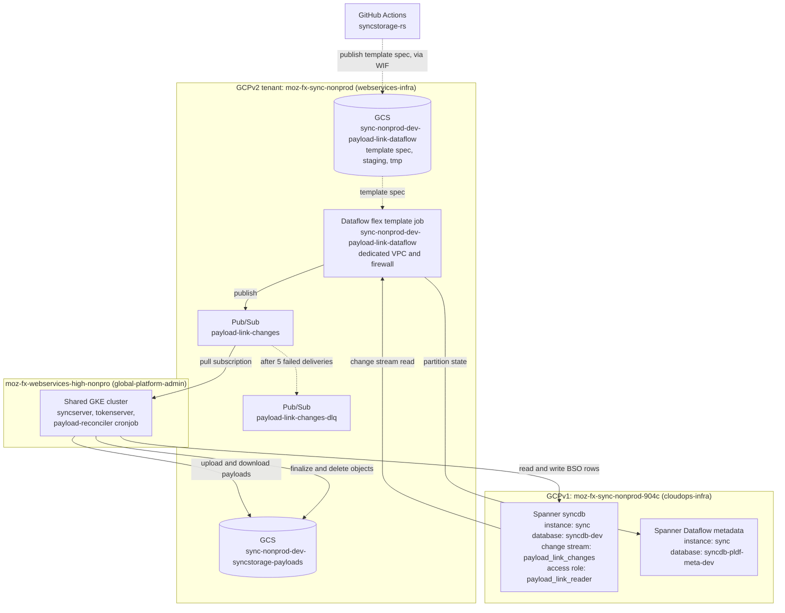

# Payload Offload Infrastructure

## Summary

This document is a map of the GCP infrastructure behind offloaded BSO
payloads: which project each resource lives in, which repo defines it,
and what applies it. It covers where things run rather than how the
pipeline behaves. For the behaviour of the change stream, Dataflow job,
Pub/Sub topics and reconciler, see
[Payload Link Reconciler](payload_link_reconciler.md).

Tracking epic: STOR-372, "Expand spanner storage beyond 2.5MB".

## The two-project split

The single most confusing thing about this setup is that Spanner and
everything else live in different GCP projects, under different
generations of Mozilla's cloud tooling.

| | Spanner | Everything else |
| --- | --- | --- |
| Project (dev) | `moz-fx-sync-nonprod-904c` | `moz-fx-sync-nonprod` |
| Generation | GCPv1 (legacy) | GCPv2 (MozCloud tenant) |
| Managed from | `cloudops-infra` | `webservices-infra` + `global-platform-admin` |

The Spanner instances stayed in GCPv1 on purpose. Migrating the large
prod instance is not cheap, so they were left in place while the rest of
the service moved to MozCloud. The practical consequences:

1. Terraform in `webservices-infra` cannot configure the Spanner
   instances or databases. Those changes need `cloudops-infra`, which
   means an extra PR and a MozCloud engineer to apply it.
2. The webservices Terraform admin service account has no
   `setIamPolicy` rights on `-904c`, so IAM grants that target the
   Spanner database have to be applied out of band. See
   [Out-of-band steps](#out-of-band-steps) below.

The Dataflow job bridges the two projects: it runs in the tenant project
and reads a change stream in the legacy project.

## Diagram



Note that the workloads do not run in the tenant project. Sync is
`risk_level: high`, so its pods run on the shared high risk GKE cluster
in `moz-fx-webservices-high-nonpro` (nonprod) and
`moz-fx-webservices-high-prod` (prod). The tenant project holds the
data plane resources: buckets, Pub/Sub, secrets, service accounts, DNS,
and the Dataflow job. Pods reach tenant resources through workload
identity on the tenant GKE service account.

## Where each piece is defined

| Resource | Defined in | Repo |
| --- | --- | --- |
| Tenant definition (envs, charts, risk rating, project ids) | `tenants/sync.yaml` | global-platform-admin |
| Tenant GCP projects, enabled APIs, folders, DNS, GAR | `projects/tf/webservices/locals.tf` | global-platform-admin |
| Shared GKE, GCLB, logging, monitoring | `webservices-high/tf/{nonprod,prod}` | global-platform-admin |
| GCS payload bucket and lifecycle rule | `sync/tf/dev/bucket.tf` | webservices-infra |
| Dataflow job, network, firewall, job bucket | `sync/tf/dev/dataflow.tf` | webservices-infra |
| Dataflow service account and IAM | `sync/tf/dev/dataflow_iam.tf` | webservices-infra |
| Pub/Sub topics, subscriptions, DLQ routing | `sync/tf/dev/pubsub.tf` | webservices-infra |
| Spanner instance, database, DDL, database IAM | `projects/sync` | cloudops-infra |
| Change stream and access role DDL source of truth | `syncstorage-spanner/src/schema.ddl` | syncstorage-rs |
| Dataflow flex template image and metadata | `tools/payload-link-dataflow/` | syncstorage-rs |
| Image build and template spec publish | `.github/workflows/mozcloud-publish.yaml` | syncstorage-rs |
| Helm charts for sync, tokenserver, sync-jobs, sync-test | `sync/k8s/` | webservices-infra |

## Repos and how each is applied

| Repo | Scope | Automation |
| --- | --- | --- |
| [global-platform-admin](https://github.com/mozilla/global-platform-admin) | Cross tenant platform: projects, APIs, shared clusters, tenant definitions | Spacelift. The `admin-webservices-projects` stack tracks `main` with autodeploy, so a merge plans and applies without a manual step. |
| [webservices-infra](https://github.com/mozilla/webservices-infra) | Per tenant resources for the webservices function | Atlantis, autodiscovered per directory. Plan runs on the PR, then `atlantis apply` in a comment. |
| [cloudops-infra](https://github.com/mozilla-services/cloudops-infra) | Legacy GCPv1 resources, including sync Spanner | Atlantis, applied by a MozCloud engineer |
| [syncstorage-rs](https://github.com/mozilla-services/syncstorage-rs) | Application code, Spanner DDL, Dataflow template, Helm chart values | GitHub Actions builds and publishes images; ArgoCD deploys |

Terraform state for both global-platform-admin's `projects/tf/webservices`
and webservices-infra's `sync/tf/*` lives in the same bucket,
`moz-fx-webservices-terraform-state-global`, accessed by impersonating
`tf-webservices@moz-fx-websvc-terraform-admin.iam.gserviceaccount.com`.
The per environment state is at prefix `projects/sync/<env>`. The project
level state is at `projects/projects/global`, and
`sync/tf/dev/data.tf` reads it as a remote state data source to resolve
project ids and numbers. That prefix is load bearing, do not rename it
without migrating the state object.

## Concrete dev resources

Names are derived from `${application}-${realm}-${environment}` in
`sync/tf/dev/locals.tf`.

| Thing | Value |
| --- | --- |
| Tenant project | `moz-fx-sync-nonprod`, number `960020799362` |
| Spanner project | `moz-fx-sync-nonprod-904c` |
| Spanner instance and database | `sync` / `syncdb-dev` |
| Dataflow metadata database | `sync` / `syncdb-pldf-meta-dev` |
| Dataflow metadata table | `Metadata_payload_link`, pinned via `spannerMetadataTableName` |
| Change stream | `payload_link_changes` |
| Spanner database role | `payload_link_reader` |
| Payload bucket | `sync-nonprod-dev-syncstorage-payloads`, us-west1 |
| Dataflow job bucket | `sync-nonprod-dev-payload-link-dataflow`, us-west1 |
| Dataflow job | `sync-nonprod-dev-payload-link-dataflow`, us-west1 |
| Dataflow service account | `sync-nonprod-dev-payload-link@moz-fx-sync-nonprod.iam.gserviceaccount.com` |
| Template publisher service account | `sync-nonprod-dev-tmpl-pub@moz-fx-sync-nonprod.iam.gserviceaccount.com` |
| Dataflow VPC | `sync-nonprod-dev-dataflow`, internal ingress on tcp 12345-12346 |
| Pub/Sub topic | `payload-link-changes` |
| Pub/Sub DLQ | `payload-link-changes-dlq`, 5 delivery attempts |
| Reconciler subscription | `payload-link-reconciler-sub`, 60s ack, 7d retention |
| DLQ inspection subscription | `payload-link-changes-dlq-sub`, 7d retention |
| Flex template image | `us-docker.pkg.dev/moz-fx-sync-prod/sync-prod/syncserver-payload-link-dataflow` |
| Template spec | `gs://sync-nonprod-dev-payload-link-dataflow/templates/syncserver-payload-link-dataflow.json` |

Only dev is built out today.

## Standing up stage or prod

Everything below is per environment. Names derive from
`${application}-${realm}-${environment}`, so copying the dev Terraform
into the target environment directory produces the right names without
editing them.

1. **Terraform.** Copy `bucket.tf`, `pubsub.tf`, `dataflow.tf` and
   `dataflow_iam.tf` from `sync/tf/dev/` into the target environment
   directory in webservices-infra.

2. **A dedicated Spanner metadata database.** The change stream
   connector keeps its partition state in a Spanner database of its own.
   Each environment should get a separate database, for example
   `syncdb-pldf-meta-stage`, so the connector holds no write access
   to the syncstorage database. This is a cloudops-infra change.

   Pin the table inside it as well, with
   `spannerMetadataTableName = "Metadata_payload_link"` on the job.
   Dev uses that name; reusing it per environment is fine, since the
   databases are already separate. The parameter is optional and the
   consequence of skipping it is silent, so it is easy to miss: see
   step 6.

3. **DDL.** Apply the change stream and the `payload_link_reader` role to
   the target database. See [Out-of-band steps](#out-of-band-steps).

4. **Cross-project IAM.** A `-904c` admin grants the new environment's
   Dataflow service account `roles/spanner.databaseUser` on the
   syncstorage database and on the metadata database.

5. **Template spec.** Add a `write-payload-link-dataflow-spec-<env>` job
   to `.github/workflows/mozcloud-publish.yaml`, and make sure the
   environment's `-tmpl-pub` service account exists first. The spec has
   to be in the bucket before the Terraform job resource is applied.

6. **Job lifecycle.** Keep `on_delete = "cancel"`. This is not a
   dev-only shortcut: the SpannerIO change stream connector does not
   support draining at all, so `"drain"` is never the right setting for
   this pipeline. See
   [Draining a change streams pipeline](https://docs.cloud.google.com/spanner/docs/change-streams/use-dataflow#draining).
   The change stream's 7 day retention is what covers the gap while a
   replacement job comes up.

   Cancel is only safe to rely on because the metadata table name is
   pinned. The connector generates that name from a random UUID at
   graph-construction time, so an unpinned job that is cancelled and
   relaunched, or updated in place, comes up against an empty table and
   resumes from `Timestamp.now()` instead of the previous watermarks.
   Nothing errors; the records committed in between are simply never
   published, and the reconciler never learns those objects need
   finalizing or deleting. Set the name once and do not change it.

7. **Reconciler cronjob.** Enable `payloadReconciler` in the
   environment's values file in `sync/k8s/sync/`. The chart requires
   `runBudgetSeconds` to be less than `activeDeadlineSeconds`.

8. **Measure before enabling on prod.** The change stream costs Spanner
   storage that has not been quantified. Turning the stream on ahead of
   any offload traffic is the cheap way to find out.

Enabled APIs need no change. `project_services` in
`projects/tf/webservices/locals.tf` feeds both the prod and nonprod
project modules, so `moz-fx-sync-prod` already has them.

Note that provisioning the pipeline is safe on its own. Offload does
nothing until `SYNC_SYNCSTORAGE__GCS_PAYLOAD_BUCKET` and
`SYNC_SYNCSTORAGE__GCS_PAYLOAD_OFFLOAD_COLLECTIONS` are both set on
syncserver, so an environment can carry the whole pipeline with zero
traffic through it while it is verified.

## Enabled GCP APIs

The tenant project's enabled APIs are declared in
`projects/tf/webservices/locals.tf` under the `sync` entry. Enabling an
API there is a PR to global-platform-admin, since tenant teams do not
hold the IAM to enable services directly.

Current list for the sync tenant:

- `spanner.googleapis.com`
- `secretmanager.googleapis.com`
- `dataflow.googleapis.com`
- `datapipelines.googleapis.com`
- `cloudscheduler.googleapis.com`

The last three were added in
[global-platform-admin PR
#7031](https://github.com/mozilla/global-platform-admin/pull/7031) for
this work, tracked by STOR-656 and SREIN-1633.
`compute.googleapis.com` is enabled by default for every tenant project
by the shared `google_project` module, which is what Dataflow workers
need.

Two caveats on that list. First, `project_services` in
`projects/tf/webservices/locals.tf` feeds both the prod and nonprod
project modules, so those three APIs are enabled in `moz-fx-sync-prod`
as well as `moz-fx-sync-nonprod`. There is no per realm override.
Second, the current implementation launches
`google_dataflow_flex_template_job` directly, so nothing in
`webservices-infra/sync` references Data Pipelines or Cloud Scheduler
yet. Those two were requested up front in case the job moves to a
scheduled Data Pipelines definition. They are enabled but unused.

### Security assessment

Sync as a whole stays at `risk_level: high` with
`risk_rating: {confidentiality: 2, integrity: 1, availability: 4}` in
`tenants/sync.yaml`. The offload itself is low risk.

BSO payloads are encrypted client side with the user's Sync key before
they reach syncserver, so GCS holds ciphertext the server cannot
decrypt. The offload moves the same class of opaque blob that Spanner
already holds, rather than creating a new plaintext exposure. Object
keys and metadata do carry identifiers such as fxa_uid, collection and
bso_id, which is metadata rather than content.

Enabling a service grants no access on its own and creates no
identities, so IAM still gates every call. The one item worth care is
Dataflow: a principal with `roles/dataflow.developer` plus `actAs` on
the worker service account can run arbitrary pipeline code on GCE VMs
inside the tenant VPC with that account's permissions. That is why the
job runs as a dedicated per environment service account holding only
`roles/dataflow.worker`, `roles/pubsub.publisher` on one topic,
`roles/storage.objectAdmin` on the job bucket, and
`roles/spanner.databaseUser` on one database, rather than the Compute
Engine default account which carries `roles/editor`.

Spanner access is narrowed a second time inside the database. The job
runs under the `payload_link_reader` database role, which is granted
`SELECT` on the one change stream and `EXECUTE` on its read function and
nothing else, so the IAM grant alone does not let the job read BSO rows.

## Out-of-band steps

Three things are not managed by Terraform and have to be done by hand in
the right order. Getting this wrong is the usual reason a fresh
environment fails to come up.

1. Apply the change stream DDL to the Spanner database. The DDL in
   `syncstorage-spanner/src/schema.ddl` is not auto-applied. Run
   `gcloud spanner databases ddl update` against the target database
   after merging.

   That same DDL block also creates the fine-grained access role the
   Dataflow job reads through:

   ```sql
   CREATE ROLE payload_link_reader;
   GRANT SELECT ON CHANGE STREAM payload_link_changes TO ROLE payload_link_reader;
   GRANT EXECUTE ON TABLE FUNCTION READ_payload_link_changes TO ROLE payload_link_reader;
   ```

   The job is launched with `spannerDatabaseRole = "payload_link_reader"`
   (see `sync/tf/dev/dataflow.tf`), so if the role does not exist the job
   fails at startup rather than falling back to broader access. Apply the
   role and its grants in the same DDL update as the change stream.

2. Grant the Dataflow service account `roles/spanner.databaseUser` on
   the Spanner database. This targets `-904c`, where the webservices
   Terraform admin account has no `setIamPolicy` rights, so a `-904c`
   admin runs it. Tracked by STOR-655.

   ```console
   gcloud spanner databases add-iam-policy-binding syncdb-dev \
     --instance=sync --project=moz-fx-sync-nonprod-904c \
     --role=roles/spanner.databaseUser \
     --member=serviceAccount:sync-nonprod-dev-payload-link@moz-fx-sync-nonprod.iam.gserviceaccount.com
   ```

3. Publish the flex template spec into the job bucket before the
   Terraform job resource is applied, or the job has nothing to launch.
   The `write-payload-link-dataflow-spec-dev` job in
   `.github/workflows/mozcloud-publish.yaml` does this on publish.

   CI does not use the pipeline service account for this. A separate
   `-tmpl-pub` account exists purely to upload the spec, and the
   syncstorage-rs GitHub Actions workflow impersonates it through
   workload identity federation. Its bucket grant carries an IAM
   condition restricting writes to the `templates/` prefix, so CI cannot
   touch the runtime `staging/` or `tmp/` paths, and it holds nothing on
   Spanner or Pub/Sub. Both accounts are defined in
   `sync/tf/dev/dataflow_iam.tf`.

   To publish manually:

   ```console
   gcloud dataflow flex-template build \
     gs://sync-nonprod-dev-payload-link-dataflow/templates/syncserver-payload-link-dataflow.json \
     --image us-docker.pkg.dev/moz-fx-sync-prod/sync-prod/syncserver-payload-link-dataflow:<tag> \
     --sdk-language JAVA \
     --metadata-file tools/payload-link-dataflow/metadata.json
   ```

## Consoles and dashboards

Substitute the project for other environments.

- [Enabled APIs](https://console.cloud.google.com/apis/dashboard?project=moz-fx-sync-nonprod)
- [Dataflow jobs](https://console.cloud.google.com/dataflow/jobs?project=moz-fx-sync-nonprod)
- [Pub/Sub topics](https://console.cloud.google.com/cloudpubsub/topic/list?project=moz-fx-sync-nonprod)
- [GCS buckets](https://console.cloud.google.com/storage/browser?project=moz-fx-sync-nonprod)
- [Service accounts](https://console.cloud.google.com/iam-admin/serviceaccounts?project=moz-fx-sync-nonprod)
- [Spanner databases](https://console.cloud.google.com/spanner/instances/sync/databases?project=moz-fx-sync-nonprod-904c)

The tenant project Terraform is applied by the `admin-webservices-projects`
stack in Spacelift.

## Reference

Mozilla internal documents, not linked here:

- Design document: "Sync Spanner 10MB Payloads"
- "Syncstorage Payload Expansion Project Plan"
- Confluence: "Bootstrapping a tenant", under the SRE space
- Confluence: "MozCloud Customer Documentation", under the SRE space
