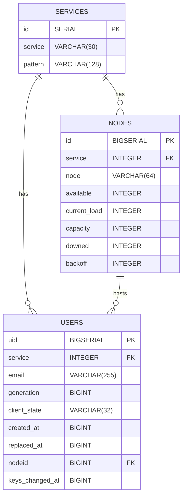

# Tokenserver - Postgres Database Implementation

## Services Table
| Column    | Type           | Description                                                                    |
| --------- | -------------- | ------------------------------------------------------------------------------ |
| `id`      | `int`          | Primary key for the service. Auto-increments with each new entry.              |
| `service` | `varchar(30)`  | A short name or identifier for the service (e.g., `sync-1.5`). Must be unique. |
| `pattern` | `varchar(128)` | An optional pattern string for URI templating (e.g., `"{node}/1.5/{uid}"`).    |

## Nodes Table
| Column          | Type          | Description                                                               |
| -------------- | ------------- | ------------------------------------------------------------------------- |
| `id`           | `BIGSERIAL`   | Primary key, auto-incrementing unique node identifier                     |
| `service`      | `INTEGER`     | References a service |
| `node`         | `VARCHAR(64)` | Unique node name under a given service                                    |
| `available`    | `INTEGER`     | Whether the node is online/available |
| `current_load` | `INTEGER`     | Number of active users/sessions|
| `capacity`     | `INTEGER`     | Max allowed load               |
| `downed`       | `INTEGER`     | Flag indicating node has gone down|
| `backoff`      | `INTEGER`     | Throttling level for the node  |
 
 ### Notes
 Regarding constraint clause that defines composite key/index:
 - Each service (sync-1.5, sync-1.1, etc.) has a set of distinct nodes.

- Node names can repeat across services, but not within a single service.

## Users Table
| Column        | Type           | Description                                                    |
| ----------------- | -------------- | -------------------------------------------------------------- |
| `uid`             | `BIGINT`       | Unique identifier for the user (primary key, auto-incremented) |
| `service`         | `INT`          | Service ID 
| `email`           | `VARCHAR(255)` | User's email address                                           |
| `generation`      | `BIGINT`       | Versioning or generation for user updates                      |
| `client_state`    | `VARCHAR(32)`  | State of the client (possibly device or app specific)          |
| `created_at`      | `BIGINT`       | Timestamp when user was created                                |
| `replaced_at`     | `BIGINT`       | Timestamp when user was replaced, nullable                     |
| `nodeid`          | `BIGINT`       | ID of the node where the user is hosted                        |
| `keys_changed_at` | `BIGINT`       | Timestamp of last key change, nullable                         |

### Notes
Notes on created indexes:

| Index Name        | Columns Indexed                    | Type      | Purpose                                                        |
| ----------------- | ---------------------------------- | --------- | -------------------------------------------------------------- |
| `lookup_idx`      | (`email`, `service`, `created_at`) | Composite | Speeds up user lookups, often by email, especially recent ones |
| `replaced_at_idx` | (`service`, `replaced_at`)         | Composite | Optimizes queries on soft-deleted or replaced users            |
| `node_idx`        | (`nodeid`)                         | Single    | Helps locate users hosted on a specific backend node           |


#### `lookup_idx`
- This is a composite index on three columns: `email`, `service`, and `created_at`.
- Leftmost prefix rule applies. The index will be used efficiently for:
```sql
WHERE email = ?

WHERE email = ? AND service = ?

WHERE email = ? AND service = ? AND created_at = ?
```
- Allows fast filtering and sorting by created_at after narrowing down by email + service.

#### `replaced_at_idx`
- This index helps optimize queries that involve tracking user.replacement events, such as soft deletions, archival, or data rollover.
- Efficient for filtering by service alone or service + replaced_at.
- Helps locate "active" vs "replaced" users quickly.

#### `node_idx`
- This index is on `nodeid`, which identifies the node hosting the user’s data, improving lookups.

## Mermaid Diagram of Tokenserver DB Relations

